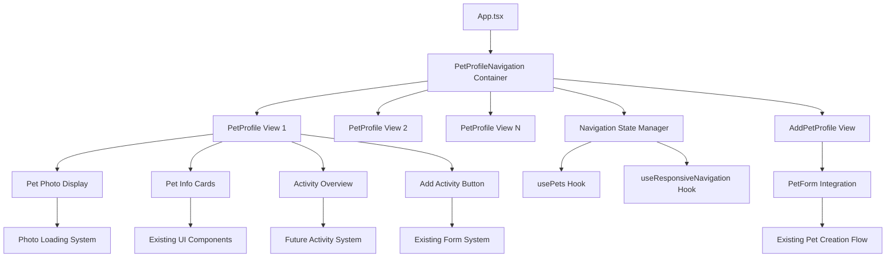

# 0001-new-home-pet-navigation-flow - Task 4

Execute task 4 for the 0001-new-home-pet-navigation-flow specification.

## Task Description
Implement activity management and user interaction features

## Code Reuse
**Leverage existing code**: PetForm patterns, Card components, date formatting utilities, accessibility patterns

## Requirements Reference
**Requirements**: 4.1-4.5, 6.3-6.5, Accessibility requirements

## Usage
```
/Task:4-0001-new-home-pet-navigation-flow
```

## Instructions

Execute with @spec-task-executor agent the following task: "Implement activity management and user interaction features"

```
Use the @spec-task-executor agent to implement task 4: "Implement activity management and user interaction features" for the 0001-new-home-pet-navigation-flow specification and include all the below context.

# Steering Context
## Steering Documents Context (Pre-loaded)

### Product Context
# Product Steering Document

# Paw Diary (刨刨日记 Pawdiary)

## Product Vision

**Mission**: Provide pet owners with a lightweight, warm, and structured application for recording their pets' complete life journey, transforming scattered photos and notes into meaningful visual data and insights.

**Slogan**: "记录每一爪的温馨时光" (Recording every paw's warm moments)

## Target Market

### Primary Users

- Pet owners with 1 or multiple pets (initially cats and dogs)
- Users who currently use scattered methods (photos, notes, chat logs) for pet tracking
- Pet enthusiasts seeking structured growth and health tracking

### User Personas

1. **Multi-Pet Parent**: Manages 2-5 pets, needs organized switching and comparison
2. **Health-Conscious Owner**: Focuses on medical records, weight tracking, vaccination schedules
3. **Memory Keeper**: Values timeline and photo documentation of pet's life journey
4. **Data-Driven Pet Owner**: Wants insights from feeding, expenses, and growth trends

## Core Value Propositions

1. **Multi-Pet Management**: Seamless switching between pet profiles with structured data
2. **Structured Recording**: Transform daily observations into categorized, searchable records
3. **Visual Timeline**: Complete chronological view of pet's life with rich media
4. **Data Insights**: Automated charts and trends for weight, diet, expenses, health
5. **Warm Experience**: Diary-like interface with pet-themed, emotional design
6. **Local Privacy**: All data stored locally with optional cloud sync

## Key Features by Milestone

### M1: Foundation Framework (Current)

- **Pet Management**: Complete pet profiles with photos, basic info, multi-pet switching
- **Activity Recording**: Structured logging for health, growth, diet, lifestyle, expenses
- **Timeline View**: Chronological activity display with category filtering
- **Basic UI**: Warm, card-based interface with paw print branding elements

### M2: Data Visualization (Next)

- **Weight Trends**: Line charts showing growth patterns over time
- **Diet Analysis**: Brand/flavor statistics and intake trend visualization
- **Health Records**: Vaccination schedules and medical history timeline
- **Expense Analytics**: Category breakdown and monthly/yearly spending curves

### M3: Cloud Sync & Reminders (Future)

- **Account System**: Email/phone registration and login
- **Multi-Device Sync**: Data synchronization across devices
- **Smart Reminders**: Vaccination, checkup, and feeding notifications

### M4: AI Assistance (Future)

- **Natural Language Processing**: "今天吃了30g皇家猫粮" → structured diet record
- **Health Insights**: Automated analysis of weight changes and health patterns
- **Personalized Reports**: Custom diet and expense recommendations

## Success Metrics

### User Experience

- **Ease of Use**: Complete activity recording in ≤3 steps
- **Performance**: Data display and charts render in <1 second
- **Engagement**: Daily active recording by 70% of users
- **Retention**: 80% monthly active user retention

### Technical Performance

- **Speed**: Pet switching experience <500ms on desktop
- **Reliability**: 99.9% data integrity, zero data loss
- **Storage**: Efficient local photo storage with compression
- **Cross-Platform**: Consistent experience across all supported platforms

## Platform Strategy

### Primary Platform: Desktop (Tauri)

- **macOS**: Native Apple ecosystem integration
- **Windows**: Broad user base coverage
- **Linux**: Developer and enthusiast users

### Future Expansion

- **iOS**: Primary mobile target with native app experience
- **Android**: Secondary mobile platform
- **Web**: Browser-based access for universal compatibility

## Design Philosophy

### Visual Identity

- **Color Palette**: Cream white (#FEF9F3), Light yellow (#FEF7CD), Light blue (#E0F2FE)
- **Brand Elements**: Paw prints, diary aesthetic, warm rounded corners
- **Typography**: Clean, readable fonts (Inter, Poppins) with proper hierarchy
- **Photography**: Consistent pet photo treatment with warm filters

### User Experience Principles

1. **Warmth Over Efficiency**: Prioritize emotional connection over pure productivity
2. **Simplicity First**: Hide complexity behind intuitive, progressive disclosure
3. **Pet-Centric Design**: Every interaction should feel like caring for the pet
4. **Memory Preservation**: Design for long-term sentimental value
5. **Gentle Reminders**: Helpful without being intrusive or demanding

## Product Constraints

### Technical Limitations

- **Local-First**: Primary data storage must be local for privacy
- **Cross-Platform**: Single codebase must work across all target platforms
- **Performance**: Must work smoothly on older hardware (5+ year old computers)
- **Offline-First**: Core functionality must work without internet connection

### User Experience Requirements

- **Accessibility**: WCAG 2.1 AA compliance for inclusive design
- **Data Export**: Users must be able to export their complete data
- **Privacy**: No telemetry or tracking without explicit user consent
- **Localization**: Support for both English and Chinese languages

## Competitive Positioning

### Direct Competitors

- Pet tracking mobile apps (PetDesk, Pet First Aid, 11Pets)
- Generic diary and note-taking applications
- Veterinary clinic software with limited home use

### Unique Differentiators

1. **Desktop-First Experience**: Optimized for detailed data entry and visualization
2. **Warm, Emotional Design**: Diary aesthetic vs. clinical/medical interfaces
3. **Local Privacy**: Complete data ownership vs. cloud-dependent services
4. **Multi-Pet Focus**: Purpose-built for households with multiple pets
5. **Visual Timeline**: Rich multimedia timeline vs. simple record lists

## Future Vision (2+ Years)

### Advanced Features

- **AI Health Monitoring**: Automated health alerts from photo analysis
- **Community Features**: Safe sharing of pet milestones with other pet parents
- **Veterinarian Integration**: Direct sharing of health records with vets
- **Insurance Integration**: Automated expense reporting to pet insurance
- **Breeding Records**: Advanced tracking for breeders and show animals

### Platform Expansion

- **Smart Device Integration**: Automatic weight tracking, activity monitors
- **Voice Recording**: Audio diary entries with transcription
- **Wearable Integration**: Health data from pet fitness trackers
- **IoT Integration**: Automatic feeding, litter box usage tracking

---

### Technology Context
# Technology Steering Document

# Paw Diary Technical Architecture & Standards

## Core Architecture

### Application Framework

- **Platform**: Tauri 2.x - Cross-platform desktop apps with web frontends
- **Frontend**: React 19+ with TypeScript for type safety and modern development
- **Backend**: Rust for performance, safety, and cross-platform compatibility
- **Build System**: Vite for frontend, Cargo for Rust backend

### Technology Stack

#### Frontend Technologies

```json
{
  "framework": "React 19+",
  "language": "TypeScript ~5.8",
  "bundler": "Vite ^7.0",
  "styling": "TailwindCSS ^3.4",
  "components": "Shadcn/ui with Radix UI primitives",
  "icons": "Lucide React ^0.312",
  "forms": "React Hook Form ^7.48 + Zod ^3.22",
  "state": "@tanstack/react-query ^5.17",
  "dragdrop": "react-beautiful-dnd ^13.1"
}
```

#### Backend Technologies

```toml
[dependencies]
tauri = "2"
tauri-plugin-opener = "2"
sqlx = { version = "0.8", features = ["runtime-tokio-rustls", "sqlite", "chrono", "migrate"] }
chrono = { version = "0.4", features = ["serde"] }
image = "0.25"  # Photo processing and optimization
serde = { version = "1", features = ["derive"] }
tokio = { version = "1.0", features = ["full"] }
uuid = { version = "1.10", features = ["v4"] }
thiserror = "1.0"
anyhow = "1.0"
```

## Database Architecture

### Primary Database: SQLite

- **Local Storage**: All user data stored locally in SQLite database
- **Migrations**: SQLx migrations for schema evolution
- **Location**: App data directory (`~/AppData/Roaming/paw-diary/pets.db` on Windows, `~/Library/Application Support/paw-diary/pets.db` on macOS)
- **Backup Strategy**: Regular automated backups to user-chosen locations

### Schema Design Principles

```sql
-- Example: pets table (existing)
CREATE TABLE pets (
    id INTEGER PRIMARY KEY AUTOINCREMENT,
    name VARCHAR(100) NOT NULL,
    birth_date DATE NOT NULL,
    species VARCHAR(20) NOT NULL CHECK (species IN ('Cat', 'Dog')),
    gender VARCHAR(10) NOT NULL CHECK (gender IN ('Male', 'Female', 'Unknown')),
    breed VARCHAR(100),
    color VARCHAR(50),
    weight_kg DECIMAL(5,2),
    photo_path VARCHAR(255),
    notes TEXT,
    display_order INTEGER DEFAULT 0,
    is_archived BOOLEAN DEFAULT FALSE,
    created_at TIMESTAMP DEFAULT CURRENT_TIMESTAMP,
    updated_at TIMESTAMP DEFAULT CURRENT_TIMESTAMP
);
```

#### Schema Standards

- **Primary Keys**: Always use `INTEGER PRIMARY KEY AUTOINCREMENT`
- **Timestamps**: Include `created_at` and `updated_at` in all data tables
- **Soft Deletes**: Use `is_archived` boolean for non-destructive removal
- **Constraints**: Use CHECK constraints for enum-like values
- **Indexing**: Index frequently queried columns (pet_id, date columns, display_order)

## File Storage Architecture

### Photo Storage

- **Location**: App data directory + `/photos/` subdirectory
- **Format**: Store in original format, generate thumbnails as needed
- **Naming**: UUID-based filenames to avoid conflicts
- **Optimization**: Rust `image` crate for resizing and format conversion
- **Limits**: 10MB max file size, common formats (JPEG, PNG, WebP, BMP, TIFF)

### Directory Structure

```
~/AppData/Roaming/paw-diary/  (Windows)
~/Library/Application Support/paw-diary/  (macOS)
~/.local/share/paw-diary/  (Linux)
├── pets.db                 # SQLite database
├── photos/                 # Pet photos
│   ├── thumbnails/         # Generated thumbnails
│   └── originals/          # Original uploaded photos
├── backups/                # Automatic database backups
└── logs/                   # Application logs
```

## API Architecture (Tauri Commands)

### Command Naming Convention

- **Verb + Noun**: `create_pet`, `get_pets`, `update_pet`, `delete_pet`
- **Async Functions**: All Tauri commands should be async
- **Error Handling**: Return `Result<T, PetError>` for all operations
- **Validation**: Validate input at command boundary

### Error Handling Standards

```rust
#[derive(Debug, thiserror::Error)]
pub enum PetError {
    #[error("Database error: {0}")]
    Database(#[from] sqlx::Error),

    #[error("File system error: {message}")]
    FileSystem { message: String },

    #[error("Validation error: {field} - {message}")]
    Validation { field: String, message: String },

    #[error("Not found: {resource} with id {id}")]
    NotFound { resource: String, id: String },
}
```

## Frontend Architecture Standards

### Component Organization

```
src/
├── components/
│   ├── ui/                 # Shadcn/ui base components
│   └── pets/               # Feature-specific components
│       ├── PetCard.tsx
│       ├── PetForm.tsx
│       └── PetManagement.tsx
├── hooks/                  # Custom React hooks
│   ├── usePets.ts
│   └── usePhotos.ts
├── lib/
│   ├── types.ts           # TypeScript type definitions
│   └── utils.ts           # Utility functions
└── styles/
    └── globals.css        # Global styles and CSS variables
```

### TypeScript Standards

- **Strict Mode**: Enable all strict type checking options
- **Interface over Type**: Prefer interfaces for object shapes
- **Zod Schemas**: Use Zod for runtime validation and type inference
- **Generic Constraints**: Use proper generic constraints for reusable components

### State Management Patterns

- **Server State**: React Query for all server state management
- **Local State**: React useState and useReducer for component state
- **Form State**: React Hook Form for all form handling
- **Global State**: React Context only when necessary (avoid prop drilling)

## Design System Implementation

### TailwindCSS Configuration

- **Custom Colors**: Pet-themed color palette with cream, yellow, blue variants
- **Brand Spacing**: Consistent spacing scale for pet cards and components
- **Custom Animations**: Paw-themed animations (wiggle, bounce-soft, pulse-slow)
- **Component Variants**: Defined variants for buttons, cards, and pet-specific elements

### Design Tokens

```css
:root {
  /* Brand Colors */
  --cream-100: #fef9f3;
  --yellow-100: #fef7cd;
  --blue-100: #e0f2fe;

  /* Pet Card Dimensions */
  --pet-card-width: 16rem;
  --pet-card-height: 20rem;

  /* Brand Shadows */
  --pet-card-shadow: 0 4px 6px -1px rgba(0, 0, 0, 0.1);
  --warm-glow: 0 4px 14px 0 rgba(251, 233, 123, 0.15);
}
```

## Performance Standards

### Frontend Performance

- **Bundle Size**: Keep initial bundle < 500KB gzipped
- **Loading Time**: First meaningful paint < 1 second
- **Runtime Performance**: 60fps animations, < 100ms interaction response
- **Memory Usage**: < 100MB RAM for typical usage

### Backend Performance

- **Database Queries**: < 100ms for typical operations
- **Photo Processing**: < 2 seconds for image optimization
- **Startup Time**: < 3 seconds cold start
- **File Operations**: Async I/O for all file system operations

## Security Standards

### Data Protection

- **Local-First**: All sensitive data stored locally by default
- **File Permissions**: Restrict database and photo access to user only
- **Input Validation**: Validate all user inputs at multiple layers
- **SQL Injection**: Use parameterized queries exclusively

### Photo Security

- **File Type Validation**: Strict MIME type checking for uploads
- **Size Limits**: 10MB maximum file size to prevent DoS
- **Path Traversal**: UUID-based filenames prevent directory traversal
- **Metadata Stripping**: Remove EXIF data for privacy (future enhancement)

## Development Standards

### Code Quality

- **Linting**: ESLint for TypeScript, Clippy for Rust
- **Formatting**: Prettier for frontend, rustfmt for backend
- **Testing**: Jest + React Testing Library for frontend, standard Rust testing for backend
- **Coverage**: Maintain >80% code coverage for critical paths

### Git Workflow

- **Branch Naming**: `feature/pet-management`, `bugfix/photo-upload-error`
- **Commit Messages**: Conventional commits format
- **PR Requirements**: All changes require code review
- **Testing**: All PRs must pass automated tests

### Documentation Standards

- **Code Comments**: Document complex business logic and algorithms
- **API Documentation**: Document all Tauri commands with examples
- **README Updates**: Keep installation and development instructions current
- **Architecture Decisions**: Document major technical decisions in ADRs

## Build and Deployment

### Development Environment

- **Node.js**: Latest LTS version (20+)
- **Rust**: Latest stable release (1.70+)
- **Package Manager**: Yarn for frontend dependencies
- **IDE Setup**: VS Code with Tauri, Rust-Analyzer, and TypeScript extensions

### Build Configuration

- **Development**: Hot reload for frontend, auto-restart for backend changes
- **Production**: Optimized bundles, compressed assets, signed executables
- **Testing**: Separate build pipeline with test databases and mock services
- **Cross-Platform**: Automated builds for Windows, macOS, and Linux

### Release Strategy

- **Versioning**: Semantic versioning (MAJOR.MINOR.PATCH)
- **Channels**: Alpha, Beta, Stable release channels
- **Auto-Updates**: Tauri updater for seamless application updates
- **Rollback**: Ability to rollback to previous version if issues detected

## Future Technical Considerations

### Scalability Preparations

- **Database Migration**: Architecture ready for PostgreSQL migration
- **Multi-User**: Database schema supports future user accounts
- **Cloud Sync**: API design compatible with future cloud services
- **Plugin System**: Component architecture allows for future plugins

### Technology Evolution

- **React**: Stay current with React releases and new features
- **Tauri**: Upgrade to new Tauri versions for improved capabilities
- **Rust**: Leverage new Rust language features as they stabilize
- **Web Standards**: Adopt new web APIs that enhance desktop app capabilities

---

### Structure Context
# Project Structure Steering Document

# Paw Diary File Organization & Conventions

## Directory Structure

### Root Level Organization

```
paw-diary/
├── .claude/                    # Claude Code configuration
│   ├── specs/                  # Feature specifications
│   ├── steering/               # Steering documents (this file)
│   └── templates/              # Spec templates
├── src/                        # Frontend React application
├── src-tauri/                  # Tauri Rust backend
├── public/                     # Static frontend assets
├── dist/                       # Frontend build output (generated)
├── specs/                      # Product and epic documentation
├── fixtures/                   # Test data and sample files
├── scripts/                    # Development and build scripts
└── [config files]             # package.json, vite.config.ts, etc.
```

### Frontend Structure (`src/`)

```
src/
├── components/                 # React components
│   ├── ui/                     # Base UI components (Shadcn/ui)
│   │   ├── button.tsx
│   │   ├── card.tsx
│   │   ├── dialog.tsx
│   │   └── [other-ui-components].tsx
│   └── pets/                   # Pet-specific feature components
│       ├── PetCard.tsx         # Individual pet display card
│       ├── PetCardList.tsx     # Pet navigation carousel
│       ├── PetDetailView.tsx   # Detailed pet information
│       ├── PetForm.tsx         # Pet creation/editing form
│       └── PetManagement.tsx   # Bulk pet operations
├── hooks/                      # Custom React hooks
│   ├── usePets.ts             # Pet data management hook
│   ├── usePhotos.ts           # Photo handling hook
│   └── [other-hooks].ts
├── lib/                        # Shared utilities and types
│   ├── types.ts               # TypeScript type definitions
│   └── utils.ts               # Utility functions (cn, formatters, etc.)
├── assets/                     # Static assets
│   └── [images, icons]
├── styles/                     # Global styles
│   └── globals.css            # Global CSS and variables
├── App.tsx                     # Root application component
├── main.tsx                    # React application entry point
└── vite-env.d.ts              # Vite type definitions
```

### Backend Structure (`src-tauri/`)

```
src-tauri/
├── src/
│   ├── main.rs                # Application entry point
│   ├── lib.rs                 # Library exports and Tauri setup
│   ├── commands.rs            # Tauri command definitions
│   ├── database.rs            # Database models and operations
│   ├── photo.rs               # Photo handling and storage
│   └── errors.rs              # Error types and handling
├── migrations/                # Database schema migrations
│   └── [timestamp]_[description].sql
├── capabilities/              # Tauri security capabilities
├── icons/                     # Application icons for different platforms
├── gen/                       # Generated platform-specific code
├── Cargo.toml                 # Rust dependencies and configuration
├── tauri.conf.json           # Tauri application configuration
└── build.rs                   # Rust build script
```

## Naming Conventions

### Files and Directories

- **Components**: PascalCase for React components (`PetCard.tsx`, `PetForm.tsx`)
- **Hooks**: camelCase starting with `use` (`usePets.ts`, `usePhotos.ts`)
- **Utilities**: camelCase for functions and files (`utils.ts`, `types.ts`)
- **Directories**: kebab-case for multi-word directories (`src-tauri`)
- **Feature Directories**: Use noun-based names (`pets/`, `activities/`, `analytics/`)

### Code Naming Standards

#### TypeScript/React

```typescript
// Interfaces: PascalCase with descriptive names
interface Pet {
  id: number;
  name: string;
}

// Components: PascalCase, descriptive, avoid abbreviations
export function PetDetailView({ pet }: PetDetailViewProps) {}

// Hooks: camelCase starting with "use"
export function usePets() {}
export function usePhotoUpload() {}

// Functions: camelCase, verb-based
function calculateAge(birthDate: string): string {}
function formatCurrency(amount: number): string {}

// Constants: SCREAMING_SNAKE_CASE
const MAX_FILE_SIZE = 10 * 1024 * 1024;
const SUPPORTED_IMAGE_FORMATS = ['jpeg', 'png', 'webp'];
```

#### Rust Backend

```rust
// Structs: PascalCase
pub struct Pet {
    pub id: i64,
    pub name: String,
}

// Functions: snake_case
pub async fn create_pet(pet_data: PetCreateRequest) -> Result<Pet, PetError> { }
pub fn calculate_age(birth_date: NaiveDate) -> String { }

// Constants: SCREAMING_SNAKE_CASE
const MAX_FILE_SIZE: usize = 10_485_760;
const DB_CONNECTION_TIMEOUT: u64 = 30;

// Enums: PascalCase for enum and variants
pub enum PetSpecies {
    Cat,
    Dog,
}
```

## Feature Organization Pattern

### Component Architecture

Each major feature should follow this structure:

```
components/[feature]/
├── [Feature]Card.tsx          # Display component
├── [Feature]Form.tsx          # Create/edit form
├── [Feature]List.tsx          # Collection display
├── [Feature]DetailView.tsx    # Detailed view
├── [Feature]Management.tsx    # Bulk operations
└── types.ts                   # Feature-specific types (if needed)
```

### Hook Organization

```
hooks/
├── use[Feature].ts            # Main data hook
├── use[Feature]Form.ts        # Form-specific hook
├── use[Feature]Upload.ts      # Upload-specific hook
└── use[Feature]Mutations.ts   # Mutation operations
```

## Code Organization Standards

### Import Order

```typescript
// 1. React and external libraries
import React, { useState, useEffect } from 'react';
import { useQuery } from '@tanstack/react-query';

// 2. Internal utilities and types
import { Pet, PetFormData } from '../../lib/types';
import { cn, calculateAge } from '../../lib/utils';

// 3. Components (UI first, then feature-specific)
import { Button } from '../ui/button';
import { Card, CardContent, CardHeader } from '../ui/card';
import { PetCard } from './PetCard';

// 4. Hooks
import { usePets } from '../../hooks/usePets';
```

### Component Structure Template

```typescript
// Component props interface
interface PetCardProps {
  pet: Pet;
  isActive: boolean;
  onClick: () => void;
  onEdit?: () => void;
}

// Component implementation
export function PetCard({
  pet,
  isActive,
  onClick,
  onEdit
}: PetCardProps) {
  // 1. Hooks
  const [isLoading, setIsLoading] = useState(false);

  // 2. Computed values
  const age = calculateAge(pet.birth_date);

  // 3. Event handlers
  const handleClick = () => {
    onClick();
  };

  // 4. Effects (if any)
  useEffect(() => {
    // Side effects
  }, []);

  // 5. Render
  return (
    <Card className={cn("pet-card", isActive && "active")}>
      {/* Component JSX */}
    </Card>
  );
}
```

## Database Organization

### Migration Naming

```
migrations/
├── 20250827151006_create_pets_table.sql
├── 20250828143022_add_activities_table.sql
├── 20250829091234_add_photo_metadata.sql
└── 20250830154501_create_reminders_table.sql
```

### Migration Format

```sql
-- Up migration
CREATE TABLE activities (
    id INTEGER PRIMARY KEY AUTOINCREMENT,
    pet_id INTEGER NOT NULL,
    activity_type VARCHAR(50) NOT NULL CHECK (activity_type IN ('health', 'growth', 'diet', 'lifestyle', 'expense')),
    title VARCHAR(200) NOT NULL,
    description TEXT,
    date DATE NOT NULL,
    metadata JSON, -- Store type-specific data
    photo_paths TEXT, -- JSON array of photo filenames
    created_at TIMESTAMP DEFAULT CURRENT_TIMESTAMP,
    updated_at TIMESTAMP DEFAULT CURRENT_TIMESTAMP,
    FOREIGN KEY (pet_id) REFERENCES pets (id) ON DELETE CASCADE
);

CREATE INDEX idx_activities_pet_date ON activities (pet_id, date DESC);
CREATE INDEX idx_activities_type ON activities (activity_type);
```

## Testing Organization

### Test File Placement

- **Frontend**: `src/components/pets/__tests__/PetCard.test.tsx`
- **Hooks**: `src/hooks/__tests__/usePets.test.ts`
- **Backend**: `src-tauri/src/commands.rs` (inline tests with `#[cfg(test)]`)

### Test Naming

```typescript
// Test suites: describe the component/function being tested
describe('PetCard', () => {
  // Test cases: describe the behavior being tested
  it('should display pet name and age', () => {});
  it('should call onClick when card is clicked', () => {});
  it('should show active state when isActive is true', () => {});
});
```

## Documentation Standards

### Code Documentation

```typescript
/**
 * Calculates the age of a pet based on birth date
 * @param birthDate - ISO date string (YYYY-MM-DD)
 * @returns Human-readable age string (e.g., "2 years, 3 months")
 */
export function calculateAge(birthDate: string): string {
  // Implementation...
}
```

### Component Documentation

```typescript
/**
 * PetCard displays a pet's basic information in a card layout
 *
 * Features:
 * - Shows pet photo, name, age, and species
 * - Supports active/inactive visual states
 * - Handles click interactions for selection
 * - Optional edit functionality
 *
 * @example
 * <PetCard
 *   pet={selectedPet}
 *   isActive={true}
 *   onClick={() => selectPet(pet.id)}
 *   onEdit={() => openEditForm(pet)}
 * />
 */
export function PetCard({ pet, isActive, onClick, onEdit }: PetCardProps) {
  // Component implementation...
}
```

## Configuration File Organization

### Root Level Config Files

```
├── package.json              # Frontend dependencies and scripts
├── yarn.lock                # Dependency lock file
├── tsconfig.json            # TypeScript compiler configuration
├── tsconfig.node.json       # TypeScript config for Node.js tools
├── vite.config.ts           # Vite build configuration
├── tailwind.config.js       # TailwindCSS configuration
├── postcss.config.js        # PostCSS configuration
└── .gitignore               # Git ignore rules
```

### Tauri Configuration

- **tauri.conf.json**: Main Tauri application configuration
- **Cargo.toml**: Rust dependencies and package metadata
- **build.rs**: Custom build script for Rust compilation

## Asset Organization

### Static Assets

```
public/
├── icons/                   # App icons and favicons
├── images/                  # Static images
└── fonts/                   # Custom fonts (if any)
```

### Generated Assets

```
src/assets/
├── react.svg               # Framework logos and brand assets
└── [other-assets]
```

## Git Organization

### Branch Naming

- **Features**: `feature/pet-activity-recording`
- **Bug Fixes**: `bugfix/photo-upload-validation`
- **Documentation**: `docs/api-documentation`
- **Refactoring**: `refactor/database-layer`

### Commit Message Format

```
feat(pets): add photo upload to pet creation form

- Add drag-and-drop photo upload component
- Implement image validation and resizing
- Update pet form to handle photo data
- Add photo preview functionality

Closes #123
```

## Future Structure Considerations

### Planned Feature Additions

```
components/
├── activities/             # Activity recording components
├── analytics/             # Data visualization components
├── reminders/             # Reminder and notification components
└── settings/              # Application settings

hooks/
├── useActivities.ts       # Activity data management
├── useAnalytics.ts        # Chart data and statistics
└── useReminders.ts        # Reminder system hooks
```

### Scalability Patterns

- **Lazy Loading**: Components organized for code splitting
- **Feature Flags**: Structure supports feature toggle implementation
- **Plugin Architecture**: Component design allows for future plugin system
- **Internationalization**: File structure ready for i18n implementation

**Note**: Steering documents have been pre-loaded. Do not use get-content to fetch them again.

# Specification Context
## Specification Context (Pre-loaded): 0001-new-home-pet-navigation-flow

### Requirements
# Requirements Document

## Introduction

This feature refines the Pawdiary UI/UX to provide a more modern, unified, and streamlined navigation experience centered around pet profiles. The feature transforms the current pet list view into an iPhone-like horizontal swipeable interface where each pet has their own dedicated profile page with prominent photo display and integrated activity management. This creates a more intimate, pet-centric experience that aligns with the app's diary-like aesthetic and emotional design principles.

## Alignment with Product Vision

This feature directly supports the core product goals outlined in product.md:

**Multi-Pet Management**: Enhances the seamless switching between pet profiles with a modern, touch-friendly interface that works consistently across desktop and mobile platforms.

**Warm Experience**: Creates a more intimate diary-like interface with large pet photos and dedicated profile pages, moving away from traditional list-based interfaces toward a more personal, emotionally engaging experience.

**Structured Recording**: Integrates the "Add Activity" functionality directly into each pet's profile page, reducing friction in the core user workflow and making activity logging more intuitive.

**Key Features Alignment (M1 Foundation Framework)**:
- **Pet Management**: Complete pet profiles with enhanced photo display and seamless multi-pet switching
- **Activity Recording**: Direct integration of activity recording from pet profile pages
- **Basic UI**: Warm, card-based interface with paw print branding elements and smooth transitions

## Requirements

### Requirement 1: Homepage Navigation Logic

**User Story:** As a first-time pet owner or returning user, I want the app to intelligently determine my homepage view based on whether I have pets, so that I can quickly access the most relevant functionality without confusion or extra navigation steps.

#### Acceptance Criteria

1. WHEN the app loads AND no pets exist THEN the system SHALL navigate directly to the Add Pet page
2. WHEN the app loads AND pets exist THEN the system SHALL display the currently active pet's profile page as the default view
3. WHEN a new pet is added AND it's the user's first pet THEN the system SHALL set this pet as active and display their profile
4. IF no currently active pet is set AND pets exist THEN the system SHALL automatically select the first non-archived pet as active

### Requirement 2: Horizontal Pet Profile Navigation

**User Story:** As a multi-pet owner, I want to swipe horizontally between my pets' individual profile pages, so that I can quickly switch focus between different pets with a natural, mobile-friendly gesture that feels familiar from other apps.

#### Acceptance Criteria

1. WHEN viewing a pet profile THEN the interface SHALL allow horizontal swiping/scrolling to navigate between pet profiles
2. WHEN swiping left THEN the system SHALL navigate to the next pet's profile page
3. WHEN swiping right THEN the system SHALL navigate to the previous pet's profile page
4. WHEN reaching the last pet while swiping left THEN the system SHALL show the Add Pet interface as the rightmost page
5. WHEN a new pet is added THEN the system SHALL position it as the rightmost page (before Add Pet)
6. WHEN navigation occurs THEN the system SHALL update the active pet state to reflect the currently visible pet
7. IF the interface is on desktop THEN the system SHALL provide clickable navigation arrows for horizontal movement

### Requirement 3: Enhanced Pet Profile Display

**User Story:** As a pet owner, I want each of my pets to have their own dedicated profile page with a prominent photo display and essential information, so that I feel more emotionally connected to my pet's digital presence.

#### Acceptance Criteria

1. WHEN viewing a pet profile THEN the system SHALL display a large, prominent pet photo as the primary visual element
2. WHEN no photo is available THEN the system SHALL display a warm, branded placeholder that maintains the intimate aesthetic
3. WHEN viewing a pet profile THEN the system SHALL show key details including name, age, species, gender, and breed in a clean, card-based format
4. WHEN viewing a pet profile THEN the system SHALL display recent activity overview/summary
5. WHEN the pet photo is displayed THEN the system SHALL apply a slightly blurred background effect to create visual depth and focus
6. WHEN viewing a pet profile THEN the interface SHALL maintain the warm color scheme (cream, light yellow, light blue) and paw-themed branding

### Requirement 4: Integrated Activity Management

**User Story:** As a pet owner, I want to quickly add new activities directly from my pet's profile page, so that I can efficiently log important events and observations without navigating away from the pet's context.

#### Acceptance Criteria

1. WHEN viewing a pet profile THEN the system SHALL display a prominent "Add Activity" button integrated into the page layout
2. WHEN the "Add Activity" button is clicked THEN the system SHALL open the activity creation interface with the current pet pre-selected
3. WHEN an activity is successfully added THEN the system SHALL refresh the pet profile to show the updated activity overview
4. WHEN viewing the activity overview THEN the system SHALL display the most recent activities with timestamps and brief descriptions
5. WHEN clicking on an activity in the overview THEN the system SHALL provide quick access to view or edit that activity

### Requirement 5: Seamless Add Pet Integration

**User Story:** As a pet owner, I want the Add Pet functionality to be seamlessly integrated into the horizontal navigation flow, so that expanding my pet family feels natural and consistent with the interface.

#### Acceptance Criteria

1. WHEN no pets exist THEN the system SHALL display the Add Pet page as the primary interface
2. WHEN pets exist THEN the Add Pet interface SHALL appear as the rightmost page in the horizontal navigation
3. WHEN the Add Pet page is accessed THEN the system SHALL display a user-friendly form with large photo upload area and simple form fields
4. WHEN a pet is successfully added THEN the system SHALL automatically navigate to the new pet's profile page and set them as active
5. WHEN creating a new pet THEN the system SHALL position them as the rightmost pet profile (before Add Pet page)

### Requirement 6: Responsive Behavior Consistency

**User Story:** As a pet owner using different devices, I want the navigation experience to work consistently across desktop and mobile platforms, so that I can use the app effectively regardless of my device.

#### Acceptance Criteria

1. WHEN using a touch device THEN the system SHALL support native touch gestures for horizontal swiping
2. WHEN using a desktop device THEN the system SHALL provide clickable navigation arrows and/or mouse wheel scrolling for horizontal movement
3. WHEN the viewport changes size THEN the system SHALL maintain the active pet focus and navigation state
4. WHEN switching between devices THEN the system SHALL remember the last active pet and resume from their profile
5. WHEN on mobile devices THEN the system SHALL optimize touch targets and spacing for finger-friendly interaction

### Requirement 7: Visual Transition and Performance

**User Story:** As a pet owner, I want smooth, responsive transitions between pet profiles, so that the interface feels polished and enjoyable to use.

#### Acceptance Criteria

1. WHEN navigating between pet profiles THEN the system SHALL provide smooth animations with transitions completing in under 300ms
2. WHEN loading pet photos THEN the system SHALL show appropriate loading states to maintain perceived performance
3. WHEN swiping/navigating THEN the system SHALL provide immediate visual feedback to confirm user interactions
4. WHEN the interface loads THEN the system SHALL prioritize loading the active pet's profile first, then pre-load adjacent pets
5. WHEN navigation animations occur THEN the system SHALL maintain 60fps performance on target devices

## Non-Functional Requirements

### Performance

- Pet profile switching must complete within 300ms to maintain smooth user experience
- Pet photo loading should show progressive loading states and complete within 2 seconds on standard connections
- Horizontal navigation animations must maintain 60fps on target desktop and mobile devices
- Initial pet profile load should complete within 1 second of app startup

### Security

- All pet data and photos must remain stored locally following existing privacy standards
- Pet profile navigation state must be preserved securely across app restarts
- Photo display must maintain existing security protocols for local file access

### Reliability

- Navigation state must be preserved accurately during app lifecycle events (minimize, restore, background)
- Pet profile display must gracefully handle missing or corrupted photo files
- Horizontal navigation must work reliably across different viewport sizes and orientations
- Add Pet functionality must maintain data integrity when integrated into navigation flow

### Usability

- Navigation gestures must be discoverable and intuitive for users familiar with mobile app patterns
- Pet profile layout must maintain readability and accessibility across different screen sizes
- "Add Activity" button must be easily accessible without interfering with navigation gestures
- Interface must provide clear visual feedback for all interactive elements
- Empty states must guide users clearly toward appropriate actions

### Accessibility

- Interface must maintain WCAG 2.1 AA compliance standards for navigation and interaction
- Pet profile navigation must support keyboard navigation for desktop users
- Pet photos must include appropriate alt text and accessibility labels
- Navigation state changes must be announced to screen readers
- Touch targets must meet minimum size requirements (44px minimum) on mobile devices

### Data Migration and Compatibility

- Navigation state must integrate seamlessly with existing SQLite pet database schema
- Active pet state must be persisted using existing pet management infrastructure
- Photo display must leverage existing photo storage and retrieval system
- Navigation preferences must be preserved across app updates and device changes

### Error Handling

- System must gracefully handle corrupted or missing pet photos with appropriate placeholder display
- Navigation must remain functional when individual pet data is corrupted or incomplete
- System must recover appropriately from navigation state inconsistencies
- Photo loading failures must not prevent navigation or profile display
- Network connectivity issues must not impact local navigation functionality

---

### Design
# Design Document

## Overview

This design transforms the current pet list interface into an iPhone-style horizontal navigation system with dedicated pet profile pages. The solution builds heavily on existing components while introducing new navigation patterns that create a more intimate, pet-focused experience. The design leverages the current PetCardList scrolling mechanism, enhances the PetDetailView for full-screen profile display, and integrates seamlessly with existing state management and data flow.

## Steering Document Alignment

### Technical Standards (tech.md)

**Framework Integration**: The design follows established Tauri + React + TypeScript patterns, utilizing existing hooks (usePets, useResponsiveNavigation) and maintaining the local-first SQLite data architecture. All new components will use the established Shadcn/ui component library and TailwindCSS styling patterns.

**Performance Standards**: Navigation transitions will meet the <300ms requirement using CSS transforms and React's built-in animation capabilities, while photo loading will leverage the existing photo protocol and caching mechanisms established in PetCard and PetDetailView components.

**Security Compliance**: The design maintains the existing photo:// protocol security model and local-first data storage, with no changes to the established privacy architecture.

### Project Structure (structure.md)

**Component Organization**: New components will follow the established `src/components/pets/` pattern with PascalCase naming. Navigation logic will be integrated into existing hooks following the `use[Feature].ts` convention. All new functionality will extend existing TypeScript interfaces in `src/lib/types.ts`.

**File Placement**: The design respects the current directory structure, placing new navigation components alongside existing pet components and extending existing hooks rather than creating parallel systems.

## Code Reuse Analysis

### Existing Components to Leverage

- **PetCardList.tsx**: The horizontal scrolling container already exists and will be adapted for full-screen profile navigation. The scroll behavior, navigation arrows, and active pet tracking provide the foundation for the new navigation system.

- **PetDetailView.tsx**: The detailed pet display component will be transformed into the new pet profile page format. The existing photo loading, error handling, and information display patterns will be preserved and enhanced.

- **PetCard.tsx & AddPetCard**: The photo display logic, gradient backgrounds, and error handling will be reused in the new profile format. The AddPetCard pattern will be integrated into the navigation flow.

- **useResponsiveNavigation.ts**: The mobile/desktop detection and responsive behavior will be extended to handle the new navigation patterns, particularly for touch gesture support.

### Integration Points

- **App.tsx ViewType System**: The existing ViewType enum will be extended with a new `PetProfile` view that replaces the current PetDetail view, maintaining compatibility with existing navigation state management.

- **usePets Hook**: The current pet data management, active pet selection, and CRUD operations will be preserved. The activePetId state will drive the new navigation system.

- **Photo Loading System**: The established photos:// protocol and error handling patterns from PetCard and PetDetailView will be reused without modification.

- **Database Integration**: No changes to the SQLite schema are required. The existing pet management infrastructure will support the new navigation patterns through current APIs.

## Architecture

The new navigation system follows a container-view pattern where the navigation container manages horizontal scrolling between full-screen pet profile views. This maintains separation of concerns while enabling smooth transitions.



## Components and Interfaces

### PetProfileNavigation Component

- **Purpose:** Main container that manages horizontal navigation between pet profiles
- **Interfaces:**
  - `pets: Pet[]` - Array of pets to navigate between
  - `activePetId: number` - Currently active pet
  - `onPetChange: (pet: Pet) => void` - Callback when navigation changes active pet
  - `onAddPet: () => void` - Callback for add pet action
- **Dependencies:** usePets, useResponsiveNavigation, PetProfile components
- **Reuses:** PetCardList scrolling logic, navigation arrow patterns

### PetProfile Component

- **Purpose:** Full-screen pet profile display replacing the current detail view
- **Interfaces:**
  - `pet: Pet` - Pet data to display
  - `isActive: boolean` - Whether this profile is currently visible
  - `onAddActivity: () => void` - Callback for activity creation
- **Dependencies:** Pet photo loading, UI cards, activity preview system
- **Reuses:** PetDetailView photo loading, PetCard gradient backgrounds, existing typography

### PetProfilePhoto Component

- **Purpose:** Large-format pet photo with blurred background effect
- **Interfaces:**
  - `pet: Pet` - Pet data including photo path
  - `size: 'large' | 'hero'` - Display size variant
- **Dependencies:** Existing photo protocol, error handling
- **Reuses:** PetCard and PetDetailView photo loading logic, error handling patterns

### AddPetProfile Component

- **Purpose:** Integrated add pet interface within navigation flow
- **Interfaces:**
  - `onSubmit: (petData: PetCreateRequest) => void` - Pet creation callback
  - `onCancel: () => void` - Cancel action callback
- **Dependencies:** PetForm, photo upload system
- **Reuses:** Existing PetForm component, AddPetCard styling patterns

### PetActivityPreview Component

- **Purpose:** Display recent activities and provide "Add Activity" integration
- **Interfaces:**
  - `petId: number` - Pet to show activities for
  - `onAddActivity: () => void` - Callback for adding new activity
  - `maxActivities?: number` - Number of recent activities to show (default: 3)
- **Dependencies:** Future activity system, existing UI components
- **Reuses:** Card components, existing button patterns

### EmptyStateHandler Component

- **Purpose:** Manages first-time user experience and empty pet state
- **Interfaces:**
  - `hasPets: boolean` - Whether any pets exist
  - `onAddFirstPet: () => void` - Callback for first pet creation
- **Dependencies:** EmptyPetList component, routing logic
- **Reuses:** Existing EmptyPetList component and styling

## Data Models

### Enhanced ViewType Enum

```typescript
export enum ViewType {
  PetList = 'pet-list',           // Deprecated in favor of PetProfile
  PetProfile = 'pet-profile',     // New primary view
  PetDetail = 'pet-detail',       // Legacy compatibility
  PetForm = 'pet-form',
  PetManagement = 'pet-management',
}
```

### Navigation State Interface

```typescript
interface PetProfileNavigationState {
  activePetIndex: number;
  pets: Pet[];
  isTransitioning: boolean;
  showAddPet: boolean;
}
```

### Navigation State Management (Unified Approach)

```typescript
// Enhanced ViewType with navigation state integration
interface NavigationState {
  currentView: ViewType;
  activePetId?: number;
  activePetIndex: number;
  isTransitioning: boolean;
  showAddPet: boolean;
}

// Activity system integration for current implementation
interface ActivityPreview {
  id: number;
  type: 'health' | 'growth' | 'diet' | 'lifestyle' | 'expense';
  title: string;
  date: string;
  summary: string;
}

// Props interfaces for new components
interface PetProfileNavigationProps {
  pets: Pet[];
  activePetId?: number;
  onPetChange: (pet: Pet) => void;
  onAddPet: () => void;
  onAddActivity: (pet: Pet) => void;
}

interface PetProfileProps {
  pet: Pet;
  isActive: boolean;
  onAddActivity: () => void;
  onEdit: () => void;
  className?: string;
}
```

## Error Handling

### Error Scenarios

1. **Photo Loading Failures**
   - **Handling:** Reuse existing PetCard error handling with graceful fallback to default pet imagery
   - **User Impact:** Seamless experience with branded placeholder maintaining visual consistency

2. **Navigation State Inconsistency**
   - **Handling:** Implement state validation and automatic correction to ensure valid active pet selection
   - **User Impact:** App automatically recovers by selecting first available pet or redirecting to add pet flow

3. **Profile Data Corruption**
   - **Handling:** Graceful degradation showing available data fields and error indicators for missing information
   - **User Impact:** Profile remains functional with clear indicators of data issues and edit prompts

4. **Touch Gesture Conflicts**
   - **Handling:** Implement proper event delegation and touch area boundaries to prevent gesture interference
   - **User Impact:** Reliable navigation gestures that don't conflict with scrollable content or buttons

## Testing Strategy

### Unit Testing

- **Navigation State Management**: Test active pet selection, navigation transitions, and state persistence
- **Photo Loading Logic**: Verify error handling, protocol usage, and loading state management
- **Responsive Behavior**: Test mobile/desktop gesture handling and viewport adaptations
- **Component Integration**: Validate proper prop passing and event handling between navigation layers

### Integration Testing

- **Pet Profile Flow**: End-to-end navigation between pets, add pet integration, and activity button functionality
- **State Synchronization**: Verify navigation state stays synchronized with pet data changes
- **Performance Testing**: Validate transition timing, photo loading performance, and animation smoothness

### End-to-End Testing

- **Complete User Journeys**: Test first-time user flow, multi-pet navigation, and pet addition workflows
- **Cross-Platform Behavior**: Validate consistent experience across desktop and mobile platforms
- **Error Recovery**: Test behavior during data corruption, photo loading failures, and network issues

## Performance Optimization

### Navigation Performance (Target: <300ms, 60fps)

- **CSS Transform Implementation**: Use `transform: translateX()` with `will-change: transform` for hardware acceleration
- **React Transition Strategy**: Implement `useTransition` with `startTransition` for non-blocking navigation updates
- **Pre-loading Strategy**: Mount adjacent pet profiles (±1) using `React.lazy()` and `Suspense` for instant transitions
- **Memory Limits**: Maintain maximum 3 mounted profiles (current + adjacent) to prevent memory bloat
- **Animation Pipeline**: Use `requestAnimationFrame` for smooth 16.67ms frame intervals

### Photo Loading Optimization (Target: <2s load time)

- **Progressive Enhancement**:
  1. Show placeholder immediately (0ms)
  2. Load low-res preview (200-500ms)
  3. Load full resolution (500-2000ms)
- **Caching Strategy**: Implement LRU cache for 10 most recent pet photos using existing protocol
- **Blur Effect Optimization**: Use CSS `filter: blur()` with `transform3d` to enable GPU acceleration
- **Loading State Management**: Show skeleton loading with 200ms delay to prevent flash

### State Management Efficiency

- **Debouncing Strategy**: 150ms debounce for rapid swipe gestures using `useDebouncedCallback`
- **Selective Rendering**: Use `React.memo()` with custom comparison for PetProfile components
- **Event Cleanup**: Implement `useEffect` cleanup for scroll, touch, and resize event listeners
- **State Batching**: Use `unstable_batchedUpdates` for simultaneous navigation state changes

## Accessibility Implementation

### Navigation Accessibility

- **Keyboard Support**: Full keyboard navigation support with proper focus management and tab ordering
- **Screen Reader Integration**: Proper ARIA labels and live regions for navigation state announcements
- **Touch Target Sizing**: Ensure all interactive elements meet minimum size requirements (44px)

### Content Accessibility

- **Image Alt Text**: Comprehensive alt text for pet photos including name and visual description
- **Semantic Structure**: Proper heading hierarchy and landmark roles for pet profile content
- **High Contrast Support**: Ensure navigation indicators and interactive elements maintain sufficient contrast

## Migration Strategy

### Backward Compatibility

- **ViewType Compatibility**: Maintain existing ViewType enum values with deprecation warnings
- **Component Interfaces**: Preserve existing component interfaces while extending functionality
- **State Management**: Ensure existing pet selection and management logic continues to function

### Progressive Enhancement

- **Feature Flags**: Implement toggle between old list view and new navigation for testing
- **Gradual Rollout**: Enable new navigation system with fallback to existing interface
- **User Preference**: Allow users to switch between navigation styles during transition period

### Data Preservation

- **State Migration**: Automatically migrate existing active pet selection to new navigation system
- **Photo Compatibility**: Ensure all existing pet photos continue to load correctly in new profile format
- **Settings Preservation**: Maintain existing user preferences and pet ordering during upgrade

## Implementation Strategy

### Phase 1: Core Navigation Infrastructure
1. **Create PetProfileNavigation container component** extending PetCardList scrolling logic
2. **Implement unified NavigationState management** replacing dual ViewType/navigation state
3. **Add PetProfile component** transforming PetDetailView for full-screen display
4. **Integrate EmptyStateHandler** for first-time user experience routing

### Phase 2: Activity System Integration
1. **Create PetActivityPreview component** with placeholder UI for activity display
2. **Add "Add Activity" button integration** connecting to existing form systems
3. **Implement activity overview display** using existing card patterns
4. **Connect to future activity data layer** with proper error handling for missing data

### Phase 3: Performance & Polish
1. **Implement progressive photo loading** with blur effects and caching
2. **Add smooth transitions** using CSS transforms and React transitions
3. **Optimize state management** with selective rendering and debouncing
4. **Add comprehensive error boundaries** for navigation failures

### Phase 4: Testing & Accessibility
1. **Implement keyboard navigation** for desktop accessibility
2. **Add ARIA labels and screen reader support** for navigation state changes
3. **Create comprehensive test suite** covering navigation, performance, and error scenarios
4. **Validate cross-platform behavior** across desktop and mobile devices

### Implementation Notes
- **Feature Flag**: Implement `ENABLE_NEW_NAVIGATION` flag for gradual rollout
- **Backward Compatibility**: Maintain existing PetList view as fallback during transition
- **Error Boundary Strategy**: Wrap navigation components with proper error boundaries
- **Performance Monitoring**: Add navigation timing metrics for performance validation

**Note**: Specification documents have been pre-loaded. Do not use get-content to fetch them again.

## Task Details
- Task ID: 4
- Description: Implement activity management and user interaction features
- Leverage: PetForm patterns, Card components, date formatting utilities, accessibility patterns
- Requirements: 4.1-4.5, 6.3-6.5, Accessibility requirements

## Instructions
- Implement ONLY task 4: "Implement activity management and user interaction features"
- Follow all project conventions and leverage existing code
- Mark the task as complete using: claude-code-spec-workflow get-tasks 0001-new-home-pet-navigation-flow 4 --mode complete
- Provide a completion summary
```

## Task Completion
When the task is complete, mark it as done:
```bash
claude-code-spec-workflow get-tasks 0001-new-home-pet-navigation-flow 4 --mode complete
```

## Next Steps
After task completion, you can:
- Execute the next task using /0001-new-home-pet-navigation-flow-task-[next-id]
- Check overall progress with /spec-status 0001-new-home-pet-navigation-flow
