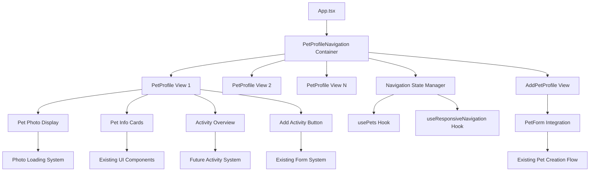

# Design Document

## Overview

This design transforms the current pet list interface into an iPhone-style horizontal navigation system with dedicated pet profile pages. The solution builds heavily on existing components while introducing new navigation patterns that create a more intimate, pet-focused experience. The design leverages the current PetCardList scrolling mechanism, enhances the PetDetailView for full-screen profile display, and integrates seamlessly with existing state management and data flow.

## Steering Document Alignment

### Technical Standards (tech.md)

**Framework Integration**: The design follows established Tauri + React + TypeScript patterns, utilizing existing hooks (usePets, useResponsiveNavigation) and maintaining the local-first SQLite data architecture. All new components will use the established Shadcn/ui component library and TailwindCSS styling patterns.

**Performance Standards**: Navigation transitions will meet the <300ms requirement using CSS transforms and React's built-in animation capabilities, while photo loading will leverage the existing photo protocol and caching mechanisms established in PetCard and PetDetailView components.

**Security Compliance**: The design maintains the existing photo:// protocol security model and local-first data storage, with no changes to the established privacy architecture.

### Project Structure (structure.md)

**Component Organization**: New components will follow the established `src/components/pets/` pattern with PascalCase naming. Navigation logic will be integrated into existing hooks following the `use[Feature].ts` convention. All new functionality will extend existing TypeScript interfaces in `src/lib/types.ts`.

**File Placement**: The design respects the current directory structure, placing new navigation components alongside existing pet components and extending existing hooks rather than creating parallel systems.

## Code Reuse Analysis

### Existing Components to Leverage

- **PetCardList.tsx**: The horizontal scrolling container already exists and will be adapted for full-screen profile navigation. The scroll behavior, navigation arrows, and active pet tracking provide the foundation for the new navigation system.

- **PetDetailView.tsx**: The detailed pet display component will be transformed into the new pet profile page format. The existing photo loading, error handling, and information display patterns will be preserved and enhanced.

- **PetCard.tsx & AddPetCard**: The photo display logic, gradient backgrounds, and error handling will be reused in the new profile format. The AddPetCard pattern will be integrated into the navigation flow.

- **useResponsiveNavigation.ts**: The mobile/desktop detection and responsive behavior will be extended to handle the new navigation patterns, particularly for touch gesture support.

### Integration Points

- **App.tsx ViewType System**: The existing ViewType enum will be extended with a new `PetProfile` view that replaces the current PetDetail view, maintaining compatibility with existing navigation state management.

- **usePets Hook**: The current pet data management, active pet selection, and CRUD operations will be preserved. The activePetId state will drive the new navigation system.

- **Photo Loading System**: The established photos:// protocol and error handling patterns from PetCard and PetDetailView will be reused without modification.

- **Database Integration**: No changes to the SQLite schema are required. The existing pet management infrastructure will support the new navigation patterns through current APIs.

## Architecture

The new navigation system follows a container-view pattern where the navigation container manages horizontal scrolling between full-screen pet profile views. This maintains separation of concerns while enabling smooth transitions.



## Components and Interfaces

### PetProfileNavigation Component

- **Purpose:** Main container that manages horizontal navigation between pet profiles
- **Interfaces:**
  - `pets: Pet[]` - Array of pets to navigate between
  - `activePetId: number` - Currently active pet
  - `onPetChange: (pet: Pet) => void` - Callback when navigation changes active pet
  - `onAddPet: () => void` - Callback for add pet action
- **Dependencies:** usePets, useResponsiveNavigation, PetProfile components
- **Reuses:** PetCardList scrolling logic, navigation arrow patterns

### PetProfile Component

- **Purpose:** Full-screen pet profile display replacing the current detail view
- **Interfaces:**
  - `pet: Pet` - Pet data to display
  - `isActive: boolean` - Whether this profile is currently visible
  - `onAddActivity: () => void` - Callback for activity creation
- **Dependencies:** Pet photo loading, UI cards, activity preview system
- **Reuses:** PetDetailView photo loading, PetCard gradient backgrounds, existing typography

### PetProfilePhoto Component

- **Purpose:** Large-format pet photo with blurred background effect
- **Interfaces:**
  - `pet: Pet` - Pet data including photo path
  - `size: 'large' | 'hero'` - Display size variant
- **Dependencies:** Existing photo protocol, error handling
- **Reuses:** PetCard and PetDetailView photo loading logic, error handling patterns

### AddPetProfile Component

- **Purpose:** Integrated add pet interface within navigation flow
- **Interfaces:**
  - `onSubmit: (petData: PetCreateRequest) => void` - Pet creation callback
  - `onCancel: () => void` - Cancel action callback
- **Dependencies:** PetForm, photo upload system
- **Reuses:** Existing PetForm component, AddPetCard styling patterns

### PetActivityPreview Component

- **Purpose:** Display recent activities and provide "Add Activity" integration
- **Interfaces:**
  - `petId: number` - Pet to show activities for
  - `onAddActivity: () => void` - Callback for adding new activity
  - `maxActivities?: number` - Number of recent activities to show (default: 3)
- **Dependencies:** Future activity system, existing UI components
- **Reuses:** Card components, existing button patterns

### EmptyStateHandler Component

- **Purpose:** Manages first-time user experience and empty pet state
- **Interfaces:**
  - `hasPets: boolean` - Whether any pets exist
  - `onAddFirstPet: () => void` - Callback for first pet creation
- **Dependencies:** EmptyPetList component, routing logic
- **Reuses:** Existing EmptyPetList component and styling

## Data Models

### Enhanced ViewType Enum

```typescript
export enum ViewType {
  PetList = 'pet-list',           // Deprecated in favor of PetProfile
  PetProfile = 'pet-profile',     // New primary view
  PetDetail = 'pet-detail',       // Legacy compatibility
  PetForm = 'pet-form',
  PetManagement = 'pet-management',
}
```

### Navigation State Interface

```typescript
interface PetProfileNavigationState {
  activePetIndex: number;
  pets: Pet[];
  isTransitioning: boolean;
  showAddPet: boolean;
}
```

### Navigation State Management (Unified Approach)

```typescript
// Enhanced ViewType with navigation state integration
interface NavigationState {
  currentView: ViewType;
  activePetId?: number;
  activePetIndex: number;
  isTransitioning: boolean;
  showAddPet: boolean;
}

// Activity system integration for current implementation
interface ActivityPreview {
  id: number;
  type: 'health' | 'growth' | 'diet' | 'lifestyle' | 'expense';
  title: string;
  date: string;
  summary: string;
}

// Props interfaces for new components
interface PetProfileNavigationProps {
  pets: Pet[];
  activePetId?: number;
  onPetChange: (pet: Pet) => void;
  onAddPet: () => void;
  onAddActivity: (pet: Pet) => void;
}

interface PetProfileProps {
  pet: Pet;
  isActive: boolean;
  onAddActivity: () => void;
  onEdit: () => void;
  className?: string;
}
```

## Error Handling

### Error Scenarios

1. **Photo Loading Failures**
   - **Handling:** Reuse existing PetCard error handling with graceful fallback to default pet imagery
   - **User Impact:** Seamless experience with branded placeholder maintaining visual consistency

2. **Navigation State Inconsistency**
   - **Handling:** Implement state validation and automatic correction to ensure valid active pet selection
   - **User Impact:** App automatically recovers by selecting first available pet or redirecting to add pet flow

3. **Profile Data Corruption**
   - **Handling:** Graceful degradation showing available data fields and error indicators for missing information
   - **User Impact:** Profile remains functional with clear indicators of data issues and edit prompts

4. **Touch Gesture Conflicts**
   - **Handling:** Implement proper event delegation and touch area boundaries to prevent gesture interference
   - **User Impact:** Reliable navigation gestures that don't conflict with scrollable content or buttons

## Testing Strategy

### Unit Testing

- **Navigation State Management**: Test active pet selection, navigation transitions, and state persistence
- **Photo Loading Logic**: Verify error handling, protocol usage, and loading state management
- **Responsive Behavior**: Test mobile/desktop gesture handling and viewport adaptations
- **Component Integration**: Validate proper prop passing and event handling between navigation layers

### Integration Testing

- **Pet Profile Flow**: End-to-end navigation between pets, add pet integration, and activity button functionality
- **State Synchronization**: Verify navigation state stays synchronized with pet data changes
- **Performance Testing**: Validate transition timing, photo loading performance, and animation smoothness

### End-to-End Testing

- **Complete User Journeys**: Test first-time user flow, multi-pet navigation, and pet addition workflows
- **Cross-Platform Behavior**: Validate consistent experience across desktop and mobile platforms
- **Error Recovery**: Test behavior during data corruption, photo loading failures, and network issues

## Performance Optimization

### Navigation Performance (Target: <300ms, 60fps)

- **CSS Transform Implementation**: Use `transform: translateX()` with `will-change: transform` for hardware acceleration
- **React Transition Strategy**: Implement `useTransition` with `startTransition` for non-blocking navigation updates
- **Pre-loading Strategy**: Mount adjacent pet profiles (±1) using `React.lazy()` and `Suspense` for instant transitions
- **Memory Limits**: Maintain maximum 3 mounted profiles (current + adjacent) to prevent memory bloat
- **Animation Pipeline**: Use `requestAnimationFrame` for smooth 16.67ms frame intervals

### Photo Loading Optimization (Target: <2s load time)

- **Progressive Enhancement**:
  1. Show placeholder immediately (0ms)
  2. Load low-res preview (200-500ms)
  3. Load full resolution (500-2000ms)
- **Caching Strategy**: Implement LRU cache for 10 most recent pet photos using existing protocol
- **Blur Effect Optimization**: Use CSS `filter: blur()` with `transform3d` to enable GPU acceleration
- **Loading State Management**: Show skeleton loading with 200ms delay to prevent flash

### State Management Efficiency

- **Debouncing Strategy**: 150ms debounce for rapid swipe gestures using `useDebouncedCallback`
- **Selective Rendering**: Use `React.memo()` with custom comparison for PetProfile components
- **Event Cleanup**: Implement `useEffect` cleanup for scroll, touch, and resize event listeners
- **State Batching**: Use `unstable_batchedUpdates` for simultaneous navigation state changes

## Accessibility Implementation

### Navigation Accessibility

- **Keyboard Support**: Full keyboard navigation support with proper focus management and tab ordering
- **Screen Reader Integration**: Proper ARIA labels and live regions for navigation state announcements
- **Touch Target Sizing**: Ensure all interactive elements meet minimum size requirements (44px)

### Content Accessibility

- **Image Alt Text**: Comprehensive alt text for pet photos including name and visual description
- **Semantic Structure**: Proper heading hierarchy and landmark roles for pet profile content
- **High Contrast Support**: Ensure navigation indicators and interactive elements maintain sufficient contrast

## Migration Strategy

### Backward Compatibility

- **ViewType Compatibility**: Maintain existing ViewType enum values with deprecation warnings
- **Component Interfaces**: Preserve existing component interfaces while extending functionality
- **State Management**: Ensure existing pet selection and management logic continues to function

### Progressive Enhancement

- **Feature Flags**: Implement toggle between old list view and new navigation for testing
- **Gradual Rollout**: Enable new navigation system with fallback to existing interface
- **User Preference**: Allow users to switch between navigation styles during transition period

### Data Preservation

- **State Migration**: Automatically migrate existing active pet selection to new navigation system
- **Photo Compatibility**: Ensure all existing pet photos continue to load correctly in new profile format
- **Settings Preservation**: Maintain existing user preferences and pet ordering during upgrade

## Implementation Strategy

### Phase 1: Core Navigation Infrastructure
1. **Create PetProfileNavigation container component** extending PetCardList scrolling logic
2. **Implement unified NavigationState management** replacing dual ViewType/navigation state
3. **Add PetProfile component** transforming PetDetailView for full-screen display
4. **Integrate EmptyStateHandler** for first-time user experience routing

### Phase 2: Activity System Integration
1. **Create PetActivityPreview component** with placeholder UI for activity display
2. **Add "Add Activity" button integration** connecting to existing form systems
3. **Implement activity overview display** using existing card patterns
4. **Connect to future activity data layer** with proper error handling for missing data

### Phase 3: Performance & Polish
1. **Implement progressive photo loading** with blur effects and caching
2. **Add smooth transitions** using CSS transforms and React transitions
3. **Optimize state management** with selective rendering and debouncing
4. **Add comprehensive error boundaries** for navigation failures

### Phase 4: Testing & Accessibility
1. **Implement keyboard navigation** for desktop accessibility
2. **Add ARIA labels and screen reader support** for navigation state changes
3. **Create comprehensive test suite** covering navigation, performance, and error scenarios
4. **Validate cross-platform behavior** across desktop and mobile devices

### Implementation Notes
- **Feature Flag**: Implement `ENABLE_NEW_NAVIGATION` flag for gradual rollout
- **Backward Compatibility**: Maintain existing PetList view as fallback during transition
- **Error Boundary Strategy**: Wrap navigation components with proper error boundaries
- **Performance Monitoring**: Add navigation timing metrics for performance validation
