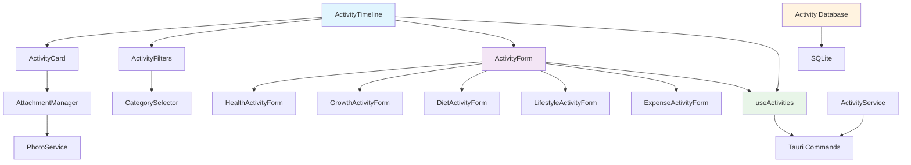

# Design Document

## Overview

The Activity Recording System is the cornerstone feature of the Paw Diary application, enabling structured data capture across five core categories: Health, Growth, Diet, Lifestyle, and Expenses. This system builds upon the existing pet management foundation to create a comprehensive activity timeline that serves as the foundation for future data visualization and AI-driven insights.

The design leverages the existing Tauri 2.x architecture with React/TypeScript frontend and Rust backend, following established patterns for database operations, photo management, and component organization. The system extends the current pet-centric data model with rich activity tracking capabilities while maintaining the warm, diary-like user experience that defines the application.

## Steering Document Alignment

### Technical Standards (tech.md)

The Activity Recording System strictly follows established technical patterns:

- **Database Layer**: Extends SQLite schema with normalized activity tables, maintaining ACID compliance and migration patterns established in the pet management system
- **Tauri Commands**: Implements async command pattern with comprehensive error handling using the existing `PetError` enum and validation framework
- **React Architecture**: Follows component organization standards with feature-specific directories, hooks for data management, and TypeScript interfaces for type safety
- **Photo Management**: Integrates with existing PhotoService for activity attachments, maintaining established file naming and storage patterns
- **Form Validation**: Uses Zod schemas and React Hook Form patterns established in pet management components

### Project Structure (structure.md)

The implementation follows documented file organization conventions:

- **Frontend Components**: Activity components organized under `src/components/activities/` with dedicated forms for each category
- **Backend Modules**: Activity-specific Rust modules following `src-tauri/src/activities.rs` pattern for database operations and business logic
- **Type Definitions**: Activity interfaces added to `src/lib/types.ts` following established naming and validation patterns
- **Hook Organization**: Activity data hooks in `src/hooks/` following `use[Feature].ts` naming convention
- **Testing Structure**: Unit tests co-located with components, integration tests in Rust modules

## Code Reuse Analysis

### Existing Components to Leverage

- **UI Components**: All Shadcn/ui components (Button, Card, Dialog, Input, Label, Select, Textarea) are reused for consistent styling
- **Form Infrastructure**: React Hook Form setup from PetForm.tsx provides the foundation for activity forms with validation patterns
- **Photo Management**: PhotoService and photo upload commands provide complete photo handling for activity attachments
- **Database Infrastructure**: PetDatabase pattern provides the model for ActivityDatabase with similar CRUD operations and error handling
- **Navigation System**: Existing navigation hooks (useAppState, usePetProfileNavigation) are extended for activity timeline navigation

### Integration Points

- **Pet Management System**: Activities are tightly coupled to pets through foreign key relationships and context selection
- **Photo Storage**: Activity photos integrate with existing PhotoService, sharing storage directory and file management operations
- **Error Handling**: Activity operations use existing PetError enum and validation framework for consistency
- **State Management**: Activity state follows established patterns with React Query for server state and React hooks for local state

### Database Schema Extensions

Building on existing pet management schema:

```sql
-- Extends existing pets table
-- Activities reference pets.id as foreign key

CREATE TABLE activities (
    id INTEGER PRIMARY KEY AUTOINCREMENT,
    pet_id INTEGER NOT NULL,
    category VARCHAR(20) NOT NULL CHECK (category IN ('health', 'growth', 'diet', 'lifestyle', 'expense')),
    subcategory VARCHAR(50) NOT NULL,
    title VARCHAR(200) NOT NULL,
    description TEXT,
    activity_date DATETIME NOT NULL,
    activity_data JSON, -- Category-specific structured data
    cost DECIMAL(10,2),
    currency VARCHAR(3) DEFAULT 'USD',
    location VARCHAR(200),
    mood_rating INTEGER CHECK (mood_rating BETWEEN 1 AND 5),
    created_at TIMESTAMP DEFAULT CURRENT_TIMESTAMP,
    updated_at TIMESTAMP DEFAULT CURRENT_TIMESTAMP,
    FOREIGN KEY (pet_id) REFERENCES pets(id) ON DELETE CASCADE
);

-- Activity attachments for photos and documents
CREATE TABLE activity_attachments (
    id INTEGER PRIMARY KEY AUTOINCREMENT,
    activity_id INTEGER NOT NULL,
    file_path VARCHAR(500) NOT NULL,
    file_type VARCHAR(20) NOT NULL,
    file_size INTEGER,
    thumbnail_path VARCHAR(500),
    metadata JSON,
    created_at TIMESTAMP DEFAULT CURRENT_TIMESTAMP,
    FOREIGN KEY (activity_id) REFERENCES activities(id) ON DELETE CASCADE
);

-- Full-text search support
CREATE VIRTUAL TABLE activities_fts USING fts5(
    title, description, category, subcategory,
    content='activities', content_rowid='id'
);
```

## Architecture

The Activity Recording System implements a layered architecture following established patterns:

### Modular Design Principles

- **Single File Responsibility**: Each component handles one specific concern (ActivityCard for display, ActivityForm for creation, ActivityTimeline for list management)
- **Component Isolation**: Small, focused components that can be independently tested and reused across different contexts
- **Service Layer Separation**: Clear separation between UI components (React), business logic (custom hooks), and data access (Tauri commands)
- **Utility Modularity**: Activity-specific utilities for date formatting, category management, and data transformation



## Components and Interfaces

### ActivityTimeline Component
- **Purpose:** Main timeline view displaying chronological activity list with infinite scroll and filtering capabilities
- **Interfaces:**
  - `ActivityTimelineProps { petId: number, initialFilters?: ActivityFilters }`
  - `onActivityClick(activity: Activity): void`
  - `onFilterChange(filters: ActivityFilters): void`
- **Dependencies:** useActivities hook, ActivityCard, ActivityFilters, React Query for pagination
- **Reuses:** Card components, existing scroll utilities, and navigation patterns from pet management

### ActivityForm Component
- **Purpose:** Dynamic form system that adapts based on selected activity category with category-specific validation
- **Interfaces:**
  - `ActivityFormProps { pet: Pet, open: boolean, onSubmit: (data: ActivityFormData) => Promise<void> }`
  - `ActivityFormData` interface with category-specific optional fields
- **Dependencies:** React Hook Form, Zod validation, category-specific subcomponents
- **Reuses:** Existing form components (Input, Select, Textarea), validation patterns from PetForm

### CategorySelector Component
- **Purpose:** Quick category selection interface with visual category indicators and recent activity suggestions
- **Interfaces:**
  - `CategorySelectorProps { onCategorySelect: (category: ActivityCategory) => void, recentActivities?: Activity[] }`
  - `ActivityCategory` enum with five main categories
- **Dependencies:** Category configuration, recent activity data
- **Reuses:** Button variants, icon system, and styling patterns from existing UI components

### ActivityCard Component
- **Purpose:** Individual activity display with category-specific styling, attachment previews, and quick actions
- **Interfaces:**
  - `ActivityCardProps { activity: Activity, onEdit?: () => void, onDelete?: () => void, compact?: boolean }`
  - Activity interface with all category data
- **Dependencies:** Activity attachment system, date formatting utilities
- **Reuses:** Card component, photo display patterns from PetCard, button styling

### AttachmentManager Component
- **Purpose:** Photo and document upload, display, and management for activity entries
- **Interfaces:**
  - `AttachmentManagerProps { activityId: number, attachments: ActivityAttachment[], onAttachmentChange: (attachments: ActivityAttachment[]) => void }`
  - `ActivityAttachment` interface for file metadata
- **Dependencies:** PhotoService integration, file upload utilities
- **Reuses:** Photo upload logic from pet management, thumbnail generation, drag-and-drop patterns

### Category-Specific Form Components

#### HealthActivityForm
- **Purpose:** Health-specific fields including vet information, symptoms, medications, and priority flags
- **Interfaces:** HealthActivityData with medical-specific fields
- **Dependencies:** Medical terminology lists, vet clinic database
- **Reuses:** Form validation patterns, input components, date/time pickers

#### GrowthActivityForm
- **Purpose:** Growth tracking with weight entry, unit conversion, and milestone recording
- **Interfaces:** GrowthActivityData with measurement fields
- **Dependencies:** Unit conversion utilities, growth milestone templates
- **Reuses:** Number input patterns, validation, progress visualization components

#### DietActivityForm
- **Purpose:** Food intake tracking with brand database, portion sizes, and preference ratings
- **Interfaces:** DietActivityData with nutrition fields
- **Dependencies:** Food database, portion calculation utilities
- **Reuses:** Rating components, search/autocomplete patterns, number inputs

#### LifestyleActivityForm
- **Purpose:** Activity duration tracking with timer functionality, mood ratings, and location tagging
- **Interfaces:** LifestyleActivityData with duration and location fields
- **Dependencies:** Timer utilities, location services, mood rating system
- **Reuses:** Timer components, rating interfaces, location input patterns

#### ExpenseActivityForm
- **Purpose:** Expense tracking with receipt OCR, recurring expense setup, and budget integration
- **Interfaces:** ExpenseActivityData with financial fields
- **Dependencies:** OCR service integration, currency formatting, budget calculation
- **Reuses:** Photo upload for receipts, number formatting, form validation

## Data Models

### Base Activity Model
```typescript
interface Activity {
  id: number;
  pet_id: number;
  category: ActivityCategory;
  subcategory: string;
  title: string;
  description?: string;
  activity_date: string; // ISO datetime
  activity_data: CategorySpecificData; // JSON field for category data
  cost?: number;
  currency?: string;
  location?: string;
  mood_rating?: 1 | 2 | 3 | 4 | 5;
  attachments: ActivityAttachment[];
  created_at: string;
  updated_at: string;
}
```

### Category-Specific Data Interfaces
```typescript
interface HealthActivityData {
  veterinarian_name?: string;
  clinic_name?: string;
  symptoms?: string[];
  diagnosis?: string;
  treatment?: string;
  medications?: Medication[];
  next_appointment?: string; // ISO date
  is_critical?: boolean;
  weight_check?: WeightMeasurement;
}

interface GrowthActivityData {
  weight?: { value: number; unit: 'kg' | 'lbs'; context?: string };
  height?: { value: number; unit: 'cm' | 'in' };
  milestone_type?: string;
  milestone_description?: string;
  comparison_photos?: string[]; // Array of photo filenames
  development_stage?: string;
}

interface DietActivityData {
  food_brand?: string;
  food_product?: string;
  portion_size?: { amount: number; unit: string };
  feeding_schedule?: string;
  food_rating?: 1 | 2 | 3 | 4 | 5;
  allergic_reaction?: boolean;
  ingredients?: string[];
  nutritional_info?: NutritionInfo;
}

interface LifestyleActivityData {
  duration_minutes?: number;
  start_time?: string;
  end_time?: string;
  energy_level?: 1 | 2 | 3 | 4 | 5;
  weather_conditions?: string;
  activity_type?: string;
  social_interactions?: SocialInteraction[];
  training_progress?: TrainingProgress;
}

interface ExpenseActivityData {
  receipt_photo?: string;
  expense_category?: string;
  vendor?: string;
  tax_deductible?: boolean;
  recurring_schedule?: RecurringSchedule;
  budget_category?: string;
  payment_method?: string;
}
```

### Supporting Data Models
```typescript
interface ActivityAttachment {
  id: number;
  activity_id: number;
  file_path: string;
  file_type: 'photo' | 'document' | 'video';
  file_size: number;
  thumbnail_path?: string;
  metadata?: Record<string, any>;
  created_at: string;
}

interface ActivityFilters {
  category?: ActivityCategory[];
  date_range?: { start: string; end: string };
  search_query?: string;
  pet_id?: number;
  has_attachments?: boolean;
  cost_range?: { min: number; max: number };
}

interface ActivityFormData {
  title: string;
  category: ActivityCategory;
  subcategory: string;
  description?: string;
  date: string;
  time: string;
  cost?: number;
  location?: string;
  mood_rating?: number;
  activity_data?: Record<string, any>;
  attachments?: File[];
}
```

## Error Handling

### Error Scenarios

1. **Database Operation Failures**
   - **Handling:** Extend existing PetError enum with activity-specific error variants
   - **User Impact:** Toast notifications with actionable error messages and retry options

2. **Photo Upload Failures**
   - **Handling:** Leverage existing PhotoService error handling with activity-specific context
   - **User Impact:** Inline error display with manual retry and file validation guidance

3. **Validation Errors**
   - **Handling:** Real-time validation using Zod schemas with category-specific rules
   - **User Impact:** Field-level error messages with correction suggestions

4. **Search and Filter Failures**
   - **Handling:** Graceful degradation to cached results with background retry
   - **User Impact:** Search unavailable indicator with fallback to manual browsing

5. **Data Synchronization Issues**
   - **Handling:** Optimistic UI updates with rollback on failure
   - **User Impact:** Loading states and conflict resolution dialogs

```rust
#[derive(Debug, thiserror::Error)]
pub enum ActivityError {
    #[error("Database error: {0}")]
    Database(#[from] sqlx::Error),

    #[error("Validation error in {field}: {message}")]
    Validation { field: String, message: String },

    #[error("Activity not found: {id}")]
    NotFound { id: i64 },

    #[error("Attachment error: {message}")]
    Attachment { message: String },

    #[error("Category mismatch: expected {expected}, got {actual}")]
    CategoryMismatch { expected: String, actual: String },
}
```

## Testing Strategy

### Unit Testing

**Frontend Components:**
- ActivityForm validation with Zod schema testing
- ActivityCard rendering with different activity types
- CategorySelector interaction and selection logic
- Date and time formatting utilities
- Category-specific form component behavior

**Backend Services:**
- Activity CRUD operations with comprehensive data scenarios
- Search and filtering logic with edge cases
- Category-specific data validation and transformation
- Database migration and schema consistency

**Custom Hooks:**
- useActivities data fetching and caching behavior
- Activity filtering and sorting logic
- Photo attachment management workflows
- Error handling and recovery scenarios

### Integration Testing

**End-to-End Activity Workflows:**
- Complete activity creation process across all categories
- Activity timeline navigation and filtering
- Photo attachment upload and display
- Activity editing and deletion workflows
- Search functionality across large datasets

**Database Integration:**
- Activity creation with pet relationship validation
- Full-text search functionality with complex queries
- Activity attachment management with file operations
- Data migration scenarios with existing pet data

**Cross-Component Integration:**
- Pet selection context flowing to activity forms
- Activity data updates reflecting in timeline views
- Photo service integration with activity attachments
- Navigation between pet profiles and activity timelines

### End-to-End Testing

**User Scenarios:**
- Pet owner recording daily feeding activity with photos
- Health tracking workflow from symptom recording to vet visit
- Growth milestone documentation with comparison photos
- Expense tracking with receipt photo and budget integration
- Timeline review with filtering and search across multiple pets

**Performance Testing:**
- Timeline rendering with 1000+ activities
- Search response time with large datasets
- Photo upload and processing performance
- Database query optimization verification
- Memory usage during extended session

**Cross-Platform Testing:**
- Activity recording functionality on macOS, Windows, Linux
- Photo attachment handling across different file systems
- Responsive design behavior on various screen sizes
- Keyboard navigation and accessibility compliance
- Data persistence and recovery across app restarts