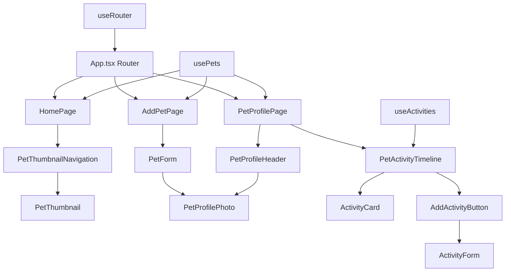

# Design Document

## Overview

This design transforms the current 335-line monolithic `App.tsx` into a clean, modular React Router-based architecture. The refactor implements a pet-centric design where each pet has its own profile page with associated activity timeline, eliminating the global activity system in favor of strict pet-activity binding.

The new architecture follows modern React patterns with clear separation of concerns: routing logic isolated in `App.tsx`, page-level components for major views, and feature-specific components organized by domain (`pets/`, `activities/`).

## Steering Document Alignment

### Technical Standards (tech.md)

**React Architecture Compliance:**
- Uses React 19+ with TypeScript for type safety
- Maintains TailwindCSS + Shadcn/ui component system
- Preserves existing build system (Vite) and testing framework
- Continues using React Query for server state management

**Database Integration:**
- Activities maintain required `pet_id` foreign key relationship
- Existing SQLite schema supports the pet-centric activity model
- Current Tauri command structure remains compatible

**Performance Standards:**
- Router-based navigation achieves <500ms page transitions
- Component lazy loading reduces initial bundle size
- Maintains <100MB memory usage through proper cleanup

### Project Structure (structure.md)

**Directory Organization:**
- New `pages/` directory follows established component patterns
- Maintains existing `components/pets/` and `components/activities/` structure
- Preserves `hooks/` organization with enhanced navigation hooks
- Continues using `lib/types.ts` for centralized type definitions

**Naming Conventions:**
- Page components use PascalCase: `HomePage`, `PetProfilePage`
- Hooks maintain camelCase `use` prefix: `usePetProfileNavigation`
- Route paths use kebab-case: `/pets/:petId`

## Code Reuse Analysis

### Existing Components to Leverage

- **PetThumbnail & PetThumbnailNavigation**: Reused in HomePage for pet overview display
- **PetForm & PetFormPage**: Integrated into AddPetPage with minimal changes
- **ActivityForm & ActivityTimeline**: Adapted to work within PetProfilePage context
- **PetProfilePhoto & PetProfile**: Enhanced for use in pet profile header
- **All UI Components**: Button, Card, Dialog, etc. remain unchanged

### Integration Points

- **usePets Hook**: Extended to support router-based navigation contexts
- **useAppState Hook**: Simplified to remove manual page switching logic
- **Activity System**: ActivityTimelinePage component adapted for pet-specific display
- **Photo Management**: Existing photo upload/display system preserved
- **Error Handling**: Current error boundaries and validation maintained

## Architecture

The refactored architecture implements a three-layer system:

1. **Routing Layer**: `App.tsx` handles navigation and route definitions
2. **Page Layer**: Page components manage view-level state and coordination
3. **Component Layer**: Feature components handle specific UI responsibilities

### Modular Design Principles

- **Single File Responsibility**: App.tsx only handles routing; each page manages one view; components focus on single UI concerns
- **Component Isolation**: Pet components handle pet data; activity components manage activities; UI components provide reusable interface elements
- **Service Layer Separation**: Hooks manage data operations; pages coordinate between hooks and components; components handle presentation
- **Utility Modularity**: Navigation utilities separated from data utilities; type definitions centralized; validation logic isolated



## Components and Interfaces

### App.tsx (Root Router)
- **Purpose:** Route configuration and navigation entry point
- **Interfaces:** React Router setup with protected routes and error boundaries
- **Dependencies:** React Router v6, existing error boundary components
- **Reuses:** Current initialization logic, existing loading states

### HomePage
- **Purpose:** Pet overview with thumbnail navigation for pet selection
- **Interfaces:** Pet selection, navigation to pet profiles, empty state handling
- **Dependencies:** PetThumbnailNavigation, usePets hook, React Router navigation
- **Reuses:** Existing PetThumbnailNavigation component with auto-redirect logic

### AddPetPage  
- **Purpose:** Dedicated pet creation form in full-page layout
- **Interfaces:** Pet creation form submission, navigation after success
- **Dependencies:** PetForm component, usePets hook, React Router navigation
- **Reuses:** Existing PetForm component with enhanced navigation integration

### PetProfilePage
- **Purpose:** Combined pet details and activity timeline view
- **Interfaces:** Pet profile display, activity management, timeline navigation
- **Dependencies:** PetProfileHeader, PetActivityTimeline, useActivities hook
- **Reuses:** Existing PetProfile components, adapted ActivityTimeline

### PetProfileHeader (New Component)
- **Purpose:** Pet information display at top of profile page
- **Interfaces:** Pet photo, basic info, edit actions
- **Dependencies:** PetProfilePhoto, existing pet data types
- **Reuses:** Current PetProfile component logic with layout adaptation

### PetActivityTimeline (Enhanced Component)
- **Purpose:** Pet-specific activity display with chronological ordering
- **Interfaces:** Activity list for specific pet, add activity trigger, filtering
- **Dependencies:** ActivityCard, AddActivityButton, useActivities(petId)
- **Reuses:** Existing ActivityTimeline with pet-filtering enhancement

### AddActivityButton (New Component)
- **Purpose:** Floating action button to add activities to current pet
- **Interfaces:** Activity form trigger with pet context pre-filled
- **Dependencies:** Activity form state, current pet context
- **Reuses:** Existing ActivityFAB styling patterns

## Data Models

### Enhanced Navigation State
```typescript
interface RouterNavigationState {
  currentPath: string;
  params: Record<string, string>;
  searchParams: URLSearchParams;
  canGoBack: boolean;
}
```

### Pet-Centric Activity State  
```typescript
interface PetActivityState {
  petId: number;
  activities: Activity[];
  isLoading: boolean;
  filters: ActivityFilters;
  hasMore: boolean;
}
```

### Page State Models
```typescript
interface HomePageState {
  pets: Pet[];
  isLoading: boolean;
  hasEmptyState: boolean;
}

interface PetProfilePageState {
  pet: Pet;
  activities: Activity[];
  isLoadingActivities: boolean;
  showActivityForm: boolean;
}
```

## Error Handling

### Error Scenarios

1. **Invalid Pet ID in URL**
   - **Handling:** Redirect to homepage with error message
   - **User Impact:** "Pet not found" toast, smooth redirect to pet list

2. **Network Failure During Pet Loading**
   - **Handling:** Display error boundary with retry option
   - **User Impact:** Error state with "Try Again" button, offline indicator

3. **Activity Creation Failure**
   - **Handling:** Form validation errors, rollback optimistic updates
   - **User Impact:** Inline form errors, activity not added to timeline

4. **Route Navigation Errors**
   - **Handling:** Catch router errors, fallback to known good state
   - **User Impact:** Graceful fallback to homepage, error logged

5. **Pet Creation Failure on AddPetPage**
   - **Handling:** Form stays open, show validation errors, preserve form data
   - **User Impact:** Form errors displayed, no data loss, retry available

## Testing Strategy

### Unit Testing

**Page Component Testing:**
- HomePage: Empty state handling, pet selection navigation, loading states
- AddPetPage: Form submission, validation, success navigation
- PetProfilePage: Pet loading, activity display, timeline interactions

**Hook Testing:**
- usePetProfileNavigation: Route parameter handling, navigation functions
- useActivities(petId): Pet-specific activity loading, filtering, creation

**Component Integration Testing:**
- PetActivityTimeline: Pet-specific filtering, activity display, empty states
- PetProfileHeader: Pet data display, edit navigation, photo handling

### Integration Testing

**Router Integration:**
- Navigation flow: Homepage → Pet Profile → Activity Form → Back to Profile
- URL parameter handling: Direct pet profile access via `/pets/123`
- Error route handling: Invalid pet IDs, 404 states

**Pet-Activity Relationship:**
- Activity creation: Verify activities are bound to correct pet
- Pet switching: Confirm activity timelines are isolated per pet
- Data consistency: Ensure pet deletion handles associated activities

### End-to-End Testing

**User Journey Testing:**
- Complete pet creation flow: HomePage → Add Pet → Pet Profile
- Activity management flow: Pet Profile → Add Activity → View Timeline
- Multi-pet navigation: Switch between different pet profiles

**Cross-Browser Compatibility:**
- Router functionality across browsers
- Deep linking support
- Back/forward button behavior

**Performance Testing:**
- Page transition timing (<500ms requirement)
- Memory usage during navigation
- Component cleanup verification

### Router-Specific Testing

**URL State Management:**
- Bookmarkable URLs for pet profiles
- Browser refresh handling
- Deep link functionality

**Navigation Edge Cases:**
- Rapid navigation clicks
- Concurrent route changes
- Invalid route parameters

**Error Boundary Integration:**
- Page-level error recovery
- Router error handling
- Fallback route behavior