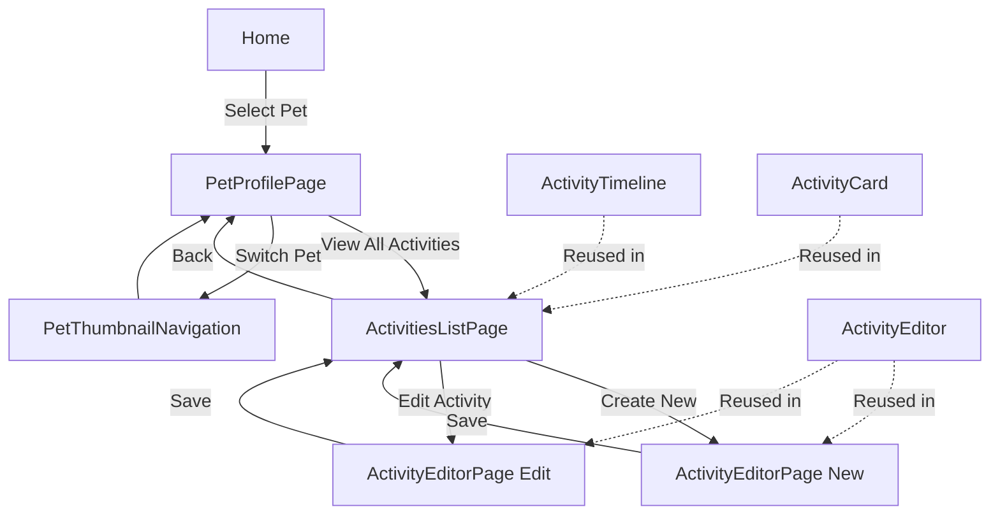

# Design Document

## Overview

The Activity Pages feature transforms the current embedded activity system into a dedicated page hierarchy that provides pet-contextual activity management. This design creates three distinct page types: ActivitiesListPage for viewing/filtering activities, ActivityEditorPage for full-screen editing, and an updated PetProfilePage that focuses on pet information with activity previews. The implementation leverages existing ActivityEditor, activity block components, and UI primitives while introducing new routing patterns and page-level components.

## Steering Document Alignment

### Technical Standards (tech.md)

- **React 19+ with TypeScript**: All new pages use functional components with proper TypeScript interfaces
- **TailwindCSS + Shadcn/ui**: Consistent styling using established design tokens and component patterns
- **React Hook Form + Zod**: Form validation using existing validation schemas for activity data
- **React Query**: Server state management for pet data and activity operations using existing patterns
- **Tauri Commands**: Backend integration using established command patterns with pet_id context validation

### Project Structure (structure.md)

```
src/
├── pages/
│   ├── ActivitiesListPage.tsx    # New: Pet activities list page
│   └── ActivityEditorPage.tsx    # New: Full-screen activity editor
├── components/
│   ├── activities/               # Leverage existing activity components
│   │   ├── ActivityEditor.tsx    # Reuse: Full editor component
│   │   ├── ActivityCard.tsx      # Reuse: Activity display cards
│   │   ├── ActivityTimeline.tsx  # Reuse: Timeline component
│   │   └── blocks/               # Reuse: All activity block components
│   └── pets/
│       └── PetProfile.tsx        # Modify: Simplify to remove full timeline
```

## Code Reuse Analysis

### Existing Components to Leverage

- **ActivityEditor.tsx**: Complete reuse as full-screen component with pet context header
- **ActivityCard.tsx**: Reuse for activity list display with click navigation to editor
- **ActivityTimeline.tsx**: Reuse in ActivitiesListPage with filtering capabilities
- **All Activity Blocks**: Direct reuse of TimeBlock, TitleBlock, NotesBlock, MeasurementBlock, etc.
- **UI Components**: Button, Card, Dialog, Badge, LoadingSpinner, and all Shadcn components
- **PetThumbnailNavigation.tsx**: Reuse for pet context switching in activities pages
- **PetProfileHeader.tsx**: Extend for activity page headers showing current pet

### Integration Points

- **Existing Router (App.tsx)**: Extend routing to support new nested pet-activity routes
- **useAppState Hook**: Leverage for pet context management across activity pages
- **Activity Types & Validation**: Reuse ActivityFormData, ActivityCategory, validation schemas
- **Tauri Commands**: Extend existing activity commands to enforce pet_id context validation
- **Database Schema**: Leverage existing activities table with pet_id foreign key relationships

## Architecture

The Activity Pages feature implements a page-based architecture that separates activity management from pet profile display while maintaining strong pet-activity context binding. The design follows React Router nested routing patterns with pet context propagation throughout the activity management flow.

### Modular Design Principles

- **Page-Level Separation**: Each page handles distinct user scenarios (list, edit, profile preview)
- **Context Propagation**: Pet context flows through URL parameters and React Context
- **Component Reuse**: Maximum leverage of existing activity editing and display components
- **Service Layer Consistency**: Maintain existing patterns for data fetching and mutations



## Components and Interfaces

### ActivitiesListPage
- **Purpose:** Dedicated page for viewing and managing all activities for a specific pet
- **Route:** `/pets/:petId/activities`
- **Interfaces:** 
  - `ActivitiesListPageProps: { petId: string }`
  - Integrates with `useActivities(petId)` hook
- **Dependencies:** ActivityTimeline, ActivityCard, filtering UI, FAB for new activity
- **Reuses:** ActivityTimeline, ActivityCard, PetProfileHeader for context

### ActivityEditorPage
- **Purpose:** Full-screen activity creation and editing with pet context
- **Routes:** 
  - `/pets/:petId/activities/new?template=xxx&mode=quick|guided`
  - `/pets/:petId/activities/:activityId/edit`
- **Interfaces:**
  - `ActivityEditorPageProps: { petId: string; activityId?: string; mode?: ActivityMode; templateId?: string }`
  - Integrates with existing `ActivityEditorProps`
- **Dependencies:** ActivityEditor, PetProfileHeader, navigation controls
- **Reuses:** Complete ActivityEditor component with all blocks and validation

### Updated PetProfilePage
- **Purpose:** Simplified pet information display with activity preview and navigation
- **Route:** `/pets/:petId`
- **Interfaces:** 
  - `PetProfilePageProps: { petId: string }`
  - `ActivityPreviewSection: { activities: Activity[]; petId: string }`
- **Dependencies:** PetProfile components, activity preview cards, "View All" navigation
- **Reuses:** Existing PetProfile components, simplified ActivityCard for previews

### PetContextHeader
- **Purpose:** Consistent header component showing current pet context across activity pages
- **Interfaces:**
  - `PetContextHeaderProps: { pet: Pet; showBackButton?: boolean; backAction?: () => void }`
- **Dependencies:** PetProfilePhoto, navigation controls
- **Reuses:** PetProfilePhoto, PetProfileHeader patterns

## Data Models

### Enhanced Route Parameters
```typescript
// URL parameter extraction for pet-contextual routing
interface PetActivityRouteParams {
  petId: string;
  activityId?: string;
}

// Query parameters for activity editor configuration
interface ActivityEditorQueryParams {
  template?: string;
  mode?: 'quick' | 'guided' | 'advanced';
}
```

### Activity List State
```typescript
// State management for activities list page
interface ActivitiesListState {
  activities: Activity[];
  filteredActivities: Activity[];
  selectedFilters: {
    categories: ActivityCategory[];
    dateRange?: { start: Date; end: Date };
    hasAttachments?: boolean;
  };
  sortOrder: 'desc' | 'asc';
  isLoading: boolean;
  error?: string;
}
```

### Pet Context State
```typescript
// Shared pet context across activity pages
interface PetActivityContext {
  currentPet: Pet;
  isLoadingPet: boolean;
  petError?: string;
  activities: Activity[];
  isLoadingActivities: boolean;
  activitiesError?: string;
}
```

## Error Handling

### Error Scenarios

1. **Invalid Pet ID in Route**
   - **Handling:** Redirect to home page with error notification
   - **User Impact:** "Pet not found" message, automatic redirect to pet selection

2. **Pet Context Lost During Navigation**
   - **Handling:** Re-fetch pet data based on URL petId parameter
   - **User Impact:** Brief loading indicator, seamless experience restoration

3. **Activity Creation/Edit Failures**
   - **Handling:** Display inline error messages, preserve form data, retry options
   - **User Impact:** Clear error descriptions, no data loss, guided recovery actions

4. **Network/Backend Connectivity Issues**
   - **Handling:** Offline-capable draft saving, sync on reconnection
   - **User Impact:** Work continues offline, automatic sync notification when connection restored

5. **Route Navigation Errors**
   - **Handling:** Fallback to parent route (activities list → pet profile → home)
   - **User Impact:** Graceful degradation with navigation breadcrumbs

## Testing Strategy

### Unit Testing

- **Page Components**: Test routing parameter handling, pet context loading, error states
- **Navigation Logic**: Test route transitions, back button behavior, context preservation
- **Activity Filtering**: Test filter combinations, search functionality, sort ordering
- **Pet Context Integration**: Test pet switching, context propagation, validation

### Integration Testing

- **Full Activity Workflow**: Pet selection → activities list → activity creation → save → return to list
- **Cross-Pet Navigation**: Switch pets and verify activity list updates correctly
- **Editor Integration**: Test all three modes (Quick/Guided/Advanced) in page context
- **Draft Management**: Test draft auto-save across page navigation and recovery

### End-to-End Testing

- **Complete User Journey**: Navigate through all activity pages, create and edit activities
- **Pet Context Validation**: Ensure activities always display under correct pet
- **Performance Testing**: Large activity lists (1000+ entries), filtering responsiveness
- **Mobile Responsiveness**: Touch interactions, responsive layouts on all activity pages

## Page-Level Architecture Details

### URL Structure and Routing

```typescript
// New routing patterns added to App.tsx
const routes = [
  // Existing routes
  { path: "/pets/:petId", element: <PetProfilePage /> },
  
  // New activity pages
  { path: "/pets/:petId/activities", element: <ActivitiesListPage /> },
  { path: "/pets/:petId/activities/new", element: <ActivityEditorPage /> },
  { path: "/pets/:petId/activities/:activityId/edit", element: <ActivityEditorPage /> },
];
```

### State Management Integration

```typescript
// Extended useAppState hook for activity page context
interface AppState {
  // Existing state...
  activityPages: {
    currentPetId?: string;
    lastVisitedActivityPage?: string;
    activityListFilters?: ActivitiesListState['selectedFilters'];
    draftActivities?: { [petId: string]: Partial<ActivityFormData> };
  };
}
```

### Component Integration Pattern

```typescript
// Page-level components integrate existing functionality
const ActivitiesListPage: React.FC<{ petId: string }> = ({ petId }) => {
  const { data: pet } = usePet(petId);
  const { data: activities } = useActivities(petId);
  
  return (
    <div className="activities-page">
      <PetContextHeader pet={pet} showBackButton backAction={() => navigate(`/pets/${petId}`)} />
      <ActivityTimeline activities={activities} onActivityClick={handleEditActivity} />
      <FAB onClick={() => navigate(`/pets/${petId}/activities/new`)} />
    </div>
  );
};
```

### Responsive Design Strategy

- **Desktop**: Full-width activity lists, side-by-side filters, keyboard shortcuts
- **Mobile**: Stacked layouts, bottom sheet filters, touch-optimized interactions
- **Tablet**: Hybrid approach with collapsible sidebars, touch and keyboard support

### Performance Optimizations

- **Virtual Scrolling**: For activity lists with 500+ entries
- **Lazy Loading**: Activity images and attachments loaded on demand
- **Route-Based Code Splitting**: Activity pages loaded separately from main bundle
- **Caching Strategy**: Activity data cached per pet with React Query

## Open Issues & Recommendations

### User Experience Enhancements

1. **Save Feedback Animation**
   - Add highlight/flash animation in ActivityTimeline when new activity is inserted
   - Smooth scroll to newly created/updated activity card for immediate visual feedback
   - Combine with toast notifications for comprehensive save confirmation

2. **Draft State Visual Indicators**
   - Display "• Draft" indicator in editor page title when unsaved changes exist
   - Add visual cues (orange border, modified timestamp) on activity cards with pending drafts
   - Implement consistent draft recovery flow with clear user prompts

3. **Unified Error Handling**
   - Implement consistent ErrorBoundary + useErrorBoundary hook across all activity pages
   - Standardize error message formats and recovery actions
   - Provide contextual error states (network, validation, server, etc.)

### Architecture Improvements

4. **Component Modularization**
   - Extract FilterBar as independent component from ActivityTimeline
   - Enable future reuse in PetProfile page for lightweight activity filtering
   - Support both full-featured (list page) and simplified (profile preview) filter modes

5. **Header Component Separation**
   - **PetProfileHeader**: Focus on pet information display (ProfilePage usage)
   - **PetContextHeader**: Activity-specific context with back button, pet avatar, activity tabs
   - Share common PetProfilePhoto subcomponent between both headers

### Routing & Navigation

6. **Query String Mode Specification**
   ```typescript
   // Enhanced routing with explicit mode parameters
   /pets/:petId/activities/new?mode=quick
   /pets/:petId/activities/new?mode=guided&template=feeding
   /pets/:petId/activities/new?mode=advanced
   ```

7. **Navigation Stack Consistency**
   - Define explicit back button behavior: Editor → List → Profile → Home
   - Handle Quick Log popup navigation edge cases correctly
   - Implement breadcrumb-style navigation for complex flows

### Data Management

8. **React Query Optimization**
   ```typescript
   // Pet-scoped cache keys to prevent cross-pet data leakage
   ['activities', petId] // Per-pet activity caching
   ['pet', petId] // Per-pet information caching
   // Automatic invalidation on successful mutations
   ```

9. **Optimistic Updates**
   - Implement optimistic insertion for new activities
   - Graceful rollback on save failures with user notification
   - Maintain temporal ordering during optimistic operations

### Backend & Database

10. **Pet Context Validation**
    ```rust
    // Rust command-level validation
    pub async fn create_activity(pet_id: i64, activity_data: ActivityCreateRequest) -> Result<Activity, PetError> {
        // Validate pet exists and is accessible
        sqlx::query!("SELECT 1 FROM pets WHERE id = ?", pet_id)
            .fetch_optional(&pool)
            .await?
            .ok_or(PetError::PetNotFound { id: pet_id })?;
        // Proceed with activity creation...
    }
    ```

11. **Enhanced Draft Schema**
    ```sql
    -- Support drafts for both new activities and editing existing ones
    ALTER TABLE activity_drafts ADD COLUMN activity_id INTEGER NULL;
    -- NULL activity_id = new activity draft
    -- Non-NULL activity_id = editing existing activity draft
    ```

### Testing Enhancements

12. **Navigation Stack Testing**
    - E2E tests for multi-pet switching → activity page → new activity workflows
    - Verify context preservation across complex navigation patterns
    - Test browser back/forward button behavior consistency

13. **Offline Draft Recovery**
    - Test scenarios: create draft → force quit app → restart → verify recovery
    - Validate draft persistence across application lifecycle
    - Test draft cleanup after successful saves or explicit cancellation

### Performance Considerations

14. **Memory Management**
    - Implement activity list virtualization for 1000+ entries
    - Image lazy loading with placeholder states
    - Component-level code splitting for editor modes

15. **Optimistic UI Updates**
    - Immediate visual feedback for all user actions
    - Seamless error recovery without UI disruption
    - Maintain smooth 60fps performance during list updates