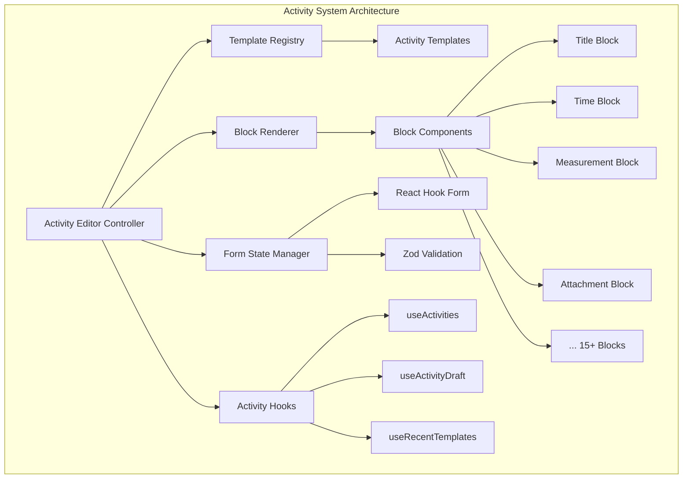

# Activity System Refactor - Design Document

## Overview

This design document outlines the technical implementation of Paw Diary's activity recording system refactor, transitioning from category-specific forms to a unified, block-based architecture. The new system implements a composable component pattern where activities are constructed from reusable "blocks" (input components), with templates defining which blocks are used for each activity type. This approach eliminates code duplication, improves maintainability, and provides a consistent user experience across all activity categories.

## Steering Document Alignment

### Technical Standards (tech.md)

The design adheres to established technical patterns:

* **Frontend Stack**: React 19+ with TypeScript, TailwindCSS, Shadcn/ui components
* **State Management**: React Hook Form for form state, React Query for server state
* **Backend**: Rust with Tauri 2.x commands for data operations
* **Database**: SQLite with creating new relevant tables
* **Validation**: Zod schemas for runtime validation and type inference
* **Performance**: Sub-100ms component rendering, <1 second data operations

### Project Structure (structure.md)

Implementation follows project organization conventions:

* **Components**: `src/components/activities/` for activity-specific components
* **Blocks**: `src/components/activities/blocks/` for individual block components
* **Hooks**: `src/hooks/useActivities.ts` and related activity hooks
* **Types**: `src/lib/types/activities.ts` for TypeScript definitions
* **Templates**: `src/lib/activityTemplates.ts` for template registry

If one file is over 400 lines, it should be split into multiple files.

## Code Reuse Analysis

### Existing Components to Leverage

* **UI Components**: All Shadcn/ui components (Button, Card, Dialog, Input, Select, etc.) will be reused as base components for blocks
* **PetForm Pattern**: The existing `PetForm.tsx` demonstrates React Hook Form + Zod validation patterns that will be applied to activity forms
* **Dialog System**: Current dialog implementation will be extended for activity editor modes
* **Photo Handling**: `PetProfilePhoto.tsx` patterns will be adapted for attachment blocks

### Integration Points

* **usePets Hook**: Activity system will integrate with existing pet context management for pet switching
* **Database Schema**: Uses existing `activities` table with `activity_data` JSON column for block data storage
* **Tauri Commands**: Extends current command patterns for activity CRUD operations
* **Navigation**: Integrates with pet profile view and timeline display

## Architecture

The block-based architecture follows a three-layer design with clear separation of concerns:

### Modular Design Principles

* **Single File Responsibility**: Each block component handles one specific input type
* **Component Isolation**: Blocks are self-contained with no cross-dependencies
* **Service Layer Separation**: Templates (configuration), blocks (UI), and data operations (hooks) are separated
* **Utility Modularity**: Block utilities (validation, formatting) are separate from components



## Components and Interfaces

### ActivityEditor Component

* **Purpose:** Main controller that orchestrates activity creation/editing across three modes
* **Interfaces:**

  ```typescript
  interface ActivityEditorProps {
    mode: 'quick' | 'guided' | 'advanced';
    templateId?: string;
    activityId?: number; // For editing existing
    petId: number;
    onSave: (activity: Activity) => void;
    onCancel: () => void;
  }
  ```
* **Dependencies:** Template Registry, Block Renderer, Form State Manager
* **Reuses:** Dialog, Sheet components from Shadcn/ui

### BlockRenderer Component

* **Purpose:** Dynamically renders appropriate block components based on template configuration
* **Interfaces:**

  ```typescript
  interface BlockRendererProps {
    block: ActivityBlockDef;
    control: Control<ActivityFormData>;
    errors: FieldErrors<ActivityFormData>;
  }
  ```
* **Dependencies:** Individual block components, React Hook Form
* **Reuses:** Form field wrapper patterns from existing forms

### Template Registry Module

* **Purpose:** Provides template definitions and block configurations for each activity type
* **Interfaces:**

  ```typescript
  interface ActivityTemplate {
    id: string;
    category: ActivityCategory;
    label: string;
    icon: string;
    blocks: ActivityBlockDef[];
  }
  ```
* **Dependencies:** None (pure configuration)
* **Reuses:** Category definitions from existing types

### Individual Block Components (15+ types)

Each block follows a consistent interface pattern:

```typescript
interface BlockProps<T> {
  control: Control<ActivityFormData>;
  name: Path<ActivityFormData>;
  label?: string;
  required?: boolean;
  config?: T; // Block-specific configuration
}
```

## Data Models

### ActivityBlockDef

```typescript
interface ActivityBlockDef {
  id: string;
  type: ActivityBlockType;
  label?: string;
  required?: boolean;
  config?: Record<string, any>;
}
```

### ActivityFormData

```typescript
interface ActivityFormData {
  petId: number;
  category: ActivityCategory;
  subcategory: string;
  templateId: string;
  blocks: Record<string, any>; // Dynamic block data
  
  // Common fields
  title: string;
  description?: string;
  activityDate: Date;
  
  // Optional based on blocks
  measurements?: Record<string, MeasurementData>;
  attachments?: AttachmentData[];
  cost?: CostData;
  reminder?: ReminderData;
  recurrence?: RecurrenceData;
}
```

### ActivityBlockType

```typescript
type ActivityBlockType = 
  | 'title' | 'notes' | 'subcategory' | 'time'
  | 'measurement' | 'rating' | 'portion' | 'timer'
  | 'location' | 'weather' | 'checklist' | 'attachment'
  | 'cost' | 'reminder' | 'people' | 'recurrence';
```

### Database Storage

```typescript
interface ActivityRecord {
  id: number;
  pet_id: number;
  category: string;
  subcategory: string;
  title: string;
  description?: string;
  activity_date: string;
  activity_data: {
    templateId: string;
    blocks: Record<string, any>;
  };
  // ... other existing fields
}
```

## Error Handling

### Error Scenarios

1. **Block Validation Failure**

   * **Handling:** Display field-level errors inline with blocks
   * **User Impact:** Red border on invalid blocks with error message below

2. **Template Loading Failure**

   * **Handling:** Fall back to basic template, log error
   * **User Impact:** Basic form shown with notification about limited features

3. **Draft Save Failure**

   * **Handling:** Retry with exponential backoff, store in localStorage as backup
   * **User Impact:** Warning toast with "Draft save delayed" message

4. **Attachment Upload Failure**

   * **Handling:** Show per-file status, allow retry, continue with other files
   * **User Impact:** Failed files marked with retry button, activity can save without them

5. **Pet Context Lost**

   * **Handling:** Prompt user to select pet before continuing
   * **User Impact:** Modal dialog requiring pet selection

## Draft & Undo Design

### Draft Storage

* **Storage Location**: Drafts are stored locally in SQLite in a new table `activity_drafts`, ensuring persistence across app restarts and multi-window usage.
* **Schema**:

  ```sql
  CREATE TABLE activity_drafts (
    id INTEGER PRIMARY KEY AUTOINCREMENT,
    pet_id INTEGER NOT NULL,
    template_id VARCHAR(50) NOT NULL,
    activity_data JSON NOT NULL,
    updated_at TIMESTAMP DEFAULT CURRENT_TIMESTAMP
  );
  ```
* **Key Design**:

  * One draft per `pet_id + template_id` combination.
  * Draft auto-saved every 3 seconds or on blur.
  * Drafts are automatically deleted upon successful save of the activity.

### Undo Functionality

* **Immediate Undo**: After saving, user sees toast:
  *"Activity saved • Undo"* (visible for 6 seconds).
* **Implementation**: Undo deletes the newly created activity record and restores draft.
* **History** (Future extension): Optionally soft-delete activities and allow recovery from a dedicated “History” tab.

### Failure Handling

* If draft save fails (DB error):

  * Retry with exponential backoff (up to 3 attempts).
  * Fallback: write draft to `localStorage` as temporary backup.
* User impact: show warning toast *"Draft save delayed, retrying..."*

## Testing Strategy

### Unit Testing

* **Block Components:** Test each block in isolation with various configurations
* **Template Registry:** Validate template structure and block definitions
* **Validation Schemas:** Test Zod schemas with valid/invalid data
* **Block Utilities:** Test formatting, parsing, and conversion functions

### Integration Testing

* **Form Submission Flow:** Test complete activity creation across all modes
* **Template Switching:** Verify block updates when changing templates
* **Draft Management:** Test auto-save and recovery scenarios
* **Pet Context Switching:** Verify data preservation and warnings

### End-to-End Testing

* **Quick Log Journey:** Create activity in ≤3 interactions
* **Guided Flow Journey:** Complete multi-step activity creation
* **Advanced Edit Journey:** Use all tabs and advanced features
* **Timeline Integration:** Verify saved activities appear correctly
* **Error Recovery:** Test network failures and recovery flows

## Block Development Priority

### MVP (Phase 1–2 Must-Haves)

* **Core Input Blocks**:

  * Title
  * Notes
  * Time & Date
  * Subcategory
  * Measurement (weight/height)
  * Attachment (photo/document)

These blocks enable the **Diet** and **Growth** flows, covering >60% of daily usage scenarios.

### Phase 3 (High Priority)

* Rating (1–5 scale)
* Portion (amount + unit)
* Timer (duration or start/stop)
* Location
* Cost

Enables full coverage of **Lifestyle** and **Expense** templates.

### Phase 4 (Extended)

* Weather
* Checklist (symptoms, training tasks)
* People (vet, trainer)
* Reminder (notifications)
* Recurrence (repeat schedules)

These blocks provide deeper functionality for **Health** and **Expense** but are not critical for MVP.

### Phase 5 (Future Enhancements)

* Advanced OCR integration for receipts and prescriptions
* Multi-pet cross-entry logging
* Rich media (video attachments, audio notes)

## Implementation Phases

### Phase 1: Core Block Infrastructure

* Implement base BlockRenderer component
* Create 5 essential blocks (Title, Notes, Time, Subcategory, Measurement)
* Set up Template Registry with basic templates
* Integrate with React Hook Form

### Phase 2: Activity Editor Modes

* Implement Quick Log bottom sheet
* Create Guided Flow wizard
* Build Advanced Edit tabbed interface
* Add mode switching logic

### Phase 3: Extended Blocks

* Implement remaining 10+ block types
* Add block-specific configurations
* Create block validation schemas
* Build attachment handling

### Phase 4: Smart Features

* Implement draft auto-save
* Add recent templates tracking
* Create intelligent defaults system
* Build undo functionality

### Phase 5: Integration & Polish

* Connect to timeline display
* Add animations and transitions
* Implement keyboard navigation
* Complete accessibility features
