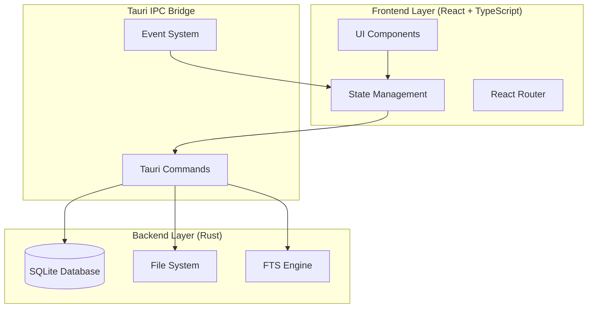

<div align="center">

# 🐾 Paw Diary (刨刨日记)

**A Modern Pet Growth Tracking Application**

*Keep track of every paw print on your pet's journey*

[](https://github.com/wty92911/paw-diary)
[](./LICENSE)
[](https://tauri.app)
[](https://www.typescriptlang.org/)
[](https://www.rust-lang.org/)

[English](./README.md) | [简体中文](./README.zh-CN.md)

</div>

---

## 📖 Table of Contents

- [Overview](#-overview)
- [Features](#-features)
- [Screenshots](#-screenshots)
- [Demo](#-demo)
- [Architecture](#-architecture)
- [Getting Started](#-getting-started)
- [Development](#-development)
- [Roadmap](#-roadmap)
- [Contributing](#-contributing)
- [License](#-license)

---

## 🌟 Overview

**Paw Diary** is a beautiful, modern desktop application that helps pet owners track their beloved companions' growth, health, diet, and daily activities. Built with cutting-edge technologies including Tauri 2.x, React 19, and TypeScript, it combines the performance of native applications with the flexibility of web technologies.

### Why Paw Diary?

- **🎨 Beautiful Design**: Warm, pet-themed interface with smooth animations
- **📊 Smart Analytics**: Visualize growth trends, health records, and spending patterns
- **🚀 Lightning Fast**: Native performance with Rust backend and optimized frontend
- **🔒 Privacy First**: All data stored locally with no tracking or analytics
- **🌐 Cross-Platform**: Works seamlessly on macOS, Windows, and Linux

---

## ✨ Features

### 🐶 Multi-Pet Management

Manage multiple pets with ease using our intuitive card-based interface.

- **Rich Profiles**: Photos, names, breeds, birth dates, and detailed information
- **Quick Switching**: Seamlessly switch between pets with smooth transitions
- **Smart Context**: Pet-specific activity tracking with intelligent defaults
- **Archive Support**: Keep inactive pets organized without losing data

<!-- Screenshot Placeholder -->
> 📸 **Screenshot Coming Soon**: Pet management interface with card-based switching

---

### 📝 Activity Recording System

Record your pet's daily activities with our innovative block-based architecture.

#### Three Interaction Modes

1. **⚡ Quick Log** - Record activities in ≤3 taps for busy moments
2. **🎯 Guided Flow** - Template-driven recording with smart suggestions
3. **✏️ Advanced Edit** - Full customization with rich media support

#### 15+ Reusable Blocks

- 📝 **Title & Notes**: Rich text input with formatting
- ⏰ **Date & Time**: Flexible datetime selection with presets
- 📏 **Measurements**: Weight, height, temperature with unit conversion
- 📷 **Attachments**: Photos and videos with preview and management
- 📍 **Location**: GPS tagging and venue search
- 🌤️ **Weather**: Automatic weather data integration
- 💰 **Cost Tracking**: Expense logging with category support
- 🏥 **Medical Info**: Symptoms, medications, and veterinary visits

<!-- Screenshot Placeholder -->
> 📸 **Screenshot Coming Soon**: Activity recording interface with block-based editor

<!-- Demo Placeholder -->
> 🎬 **Demo Coming Soon**: Quick log interaction flow (GIF)

---

### 📊 Data Visualization & Analytics

Transform raw data into actionable insights with beautiful charts and statistics.

- **📈 Growth Tracking**: Weight trends, height measurements, milestone tracking
- **🏥 Health Records**: Vaccination schedules, medical history, symptom patterns
- **🍖 Diet Analysis**: Portion tracking, brand preferences, feeding patterns
- **💳 Expense Monitoring**: Cost categorization, spending trends, budget insights
- **📅 Activity Timeline**: Chronological view with smart filtering and grouping

<!-- Screenshot Placeholder -->
> 📸 **Screenshot Coming Soon**: Dashboard with charts and analytics

---

### 🎨 Polished User Experience

Every interaction is carefully crafted for maximum usability and delight.

#### Visual Design System

- **Category Theming**: Color-coded system with vibrant gradients
  - 🔴 Health (Red) - Medical and wellness activities
  - 🔵 Growth (Blue) - Physical development tracking
  - 🟢 Diet (Green) - Feeding and nutrition
  - 🟣 Lifestyle (Purple) - Daily activities and play
  - 🟠 Expense (Orange) - Financial tracking

- **Smooth Animations**: 60fps transitions powered by Framer Motion
- **Performance**: Virtualized lists handle thousands of activities
- **Smart Search**: Full-text search with intelligent filtering
- **Responsive**: Mobile-first design with cross-platform compatibility

<!-- Screenshot Placeholder -->
> 📸 **Screenshot Coming Soon**: Activity timeline with category theming

<!-- Demo Placeholder -->
> 🎬 **Demo Coming Soon**: Timeline scrolling and filtering (GIF)

---

### 🚀 Smart Features

- **💾 Auto-save Drafts**: Never lose your work with background persistence
- **🧠 Intelligent Defaults**: Pet-specific suggestions and remembered preferences
- **📎 Rich Media**: Photo/video attachments with preview and management
- **📤 Export & Share**: Activity summaries and health reports
- **🔍 Advanced Search**: Full-text search across all activities and notes

---

## 📸 Screenshots

<!-- Main Interface -->
### Home Screen
> 🖼️ **Image Placeholder**: `docs/images/home-screen.png`
>
> *Pet selection and quick action dashboard*

<!-- Activity Timeline -->
### Activity Timeline
> 🖼️ **Image Placeholder**: `docs/images/activity-timeline.png`
>
> *Chronological view with category filtering and search*

<!-- Recording Interface -->
### Activity Recording
> 🖼️ **Image Placeholder**: `docs/images/activity-recording.png`
>
> *Block-based activity editor with live preview*

<!-- Analytics Dashboard -->
### Analytics Dashboard
> 🖼️ **Image Placeholder**: `docs/images/analytics-dashboard.png`
>
> *Charts and insights for growth, health, and expenses*

<!-- Pet Profile -->
### Pet Profile
> 🖼️ **Image Placeholder**: `docs/images/pet-profile.png`
>
> *Detailed pet information and settings*

---

## 🎬 Demo

### Quick Activity Recording
> 🎥 **Demo Placeholder**: `docs/videos/quick-log-demo.gif`
>
> *Record a meal activity in 3 taps*

### Timeline Navigation
> 🎥 **Demo Placeholder**: `docs/videos/timeline-demo.gif`
>
> *Smooth scrolling and filtering through activities*

### Data Visualization
> 🎥 **Demo Placeholder**: `docs/videos/charts-demo.gif`
>
> *Interactive charts showing growth trends*

---

## 🏗️ Architecture

### Technology Stack

<table>
<tr>
<td width="50%" valign="top">

#### Frontend
- **Framework**: React 19.1 with TypeScript 5.8
- **UI Library**: Shadcn UI + Radix UI
- **Styling**: TailwindCSS with design tokens
- **Forms**: React Hook Form + Zod validation
- **Animations**: Framer Motion
- **Virtualization**: TanStack React Virtual
- **Routing**: React Router DOM v7
- **State**: TanStack Query for server state

</td>
<td width="50%" valign="top">

#### Backend
- **Runtime**: Tauri 2.x with Rust 1.80
- **Database**: SQLite with SQLx 0.8
- **Search**: Full-text search (FTS5)
- **API**: Tauri IPC commands
- **File Storage**: Custom photos protocol
- **Validation**: Multi-layer (Zod + Rust)

</td>
</tr>
</table>

### System Architecture



### Key Design Patterns

- **Block-Based Architecture**: Composable, reusable input components
- **Command-Query Separation**: Clear Tauri command organization
- **Offline-First**: Local storage with planned cloud sync
- **Multi-Layer Validation**: Type safety from UI to database
- **Smart/Dumb Components**: Clear separation of concerns

📚 **Detailed Documentation**: See [Architecture Docs](./docs/architecture.md)

---

## 🚀 Getting Started

### Prerequisites

- **Node.js** v18+ ([Download](https://nodejs.org/))
- **Rust** latest stable ([Install](https://www.rust-lang.org/tools/install))
- **Yarn** package manager ([Install](https://yarnpkg.com/getting-started/install))
- **Platform-specific tools**:
  - macOS: Xcode Command Line Tools
  - Windows: Microsoft Visual Studio C++ Build Tools
  - Linux: Build essentials (`build-essential`, `libssl-dev`, `libgtk-3-dev`)

### Quick Start

```bash
# Clone the repository
git clone https://github.com/wty92911/paw-diary.git
cd paw-diary

# Install dependencies
yarn install

# Start development server
yarn tauri dev
```

The application will launch automatically on your desktop.

### Build for Production

```bash
# Build optimized desktop application
yarn tauri build

# Output locations:
# - macOS: src-tauri/target/release/bundle/dmg/
# - Windows: src-tauri/target/release/bundle/msi/
# - Linux: src-tauri/target/release/bundle/appimage/
```

---

## 🛠️ Development

### Project Structure

```
paw-diary/
├── src/                          # Frontend source code
│   ├── components/              # React components
│   │   ├── activities/         # Activity recording system
│   │   ├── ui/                 # Reusable UI components (Shadcn)
│   │   └── header/             # Universal header system
│   ├── lib/                    # Utilities and helpers
│   │   ├── types/              # TypeScript type definitions
│   │   ├── summary/            # Smart fact extraction
│   │   └── utils/              # General utilities
│   └── App.tsx                 # Root component
├── src-tauri/                  # Rust backend
│   ├── src/
│   │   ├── database/          # SQLite operations
│   │   ├── commands/          # Tauri command handlers
│   │   └── lib.rs             # Main library entry
│   └── tauri.conf.json        # Tauri configuration
├── docs/                       # Documentation
│   ├── product.md             # Product documentation
│   └── architecture.md        # Technical architecture
└── specs/                      # Product specifications
    ├── 0001-prd.md           # Product requirements
    └── 001-ios-app-header/   # Feature specifications
```

### Development Commands

```bash
# Frontend Development
yarn dev              # Start Vite dev server (port 1420)
yarn build            # Build frontend for production
yarn preview          # Preview production build

# Desktop Application
yarn tauri dev        # Start Tauri in development mode
yarn tauri build      # Build production desktop app
yarn tauri icon       # Generate app icons from source

# Mobile Development (iOS)
yarn ios:dev          # Start iOS development mode
yarn ios:build        # Build iOS application

# Code Quality
yarn format           # Format code with Prettier
yarn lint             # Run ESLint checks
yarn lint:fix         # Fix ESLint issues automatically
yarn typecheck        # Run TypeScript type checking

# Testing
yarn test             # Run tests with Vitest
yarn test:ui          # Run tests with UI
yarn test:coverage    # Generate coverage report
```

### Development Workflow

1. **Feature Development**: Create feature branch from `main`
2. **Implementation**: Follow TypeScript strict mode and ESLint rules
3. **Testing**: Write unit tests for components and utilities
4. **Type Safety**: Ensure full TypeScript coverage
5. **Code Review**: Open PR with detailed description
6. **CI/CD**: Automated tests and build verification

### Code Standards

- **TypeScript**: Strict mode with no implicit any
- **ESLint**: React, accessibility, and best practice rules
- **Prettier**: Consistent code formatting
- **Commits**: Conventional commit format with emojis
  ```
  ✨ feat: Add new feature
  🐛 fix: Fix bug
  📝 docs: Update documentation
  ♻️ refactor: Refactor code
  ✅ test: Add tests
  🎨 style: Update styling
  ```

---

## 🎯 Roadmap

### ✅ M1: Foundation (Completed)
- [x] Tauri + React + TypeScript setup
- [x] Pet management system (CRUD operations)
- [x] Basic activity recording
- [x] SQLite database integration

### ✅ M2: Activity System Refactor (Completed)
- [x] Block-based activity architecture (15+ blocks)
- [x] Three interaction modes (Quick Log, Guided Flow, Advanced)
- [x] Virtualized timeline with 60fps performance
- [x] Category theming and visual design system
- [x] Smart search and filtering
- [x] Photo attachment system

### 🔄 M3: Data Visualization (In Progress)
- [ ] Interactive charts (growth, health, diet trends)
- [ ] Statistical insights and pattern recognition
- [ ] Export functionality for reports
- [ ] Dashboard with key metrics and alerts
- [ ] Customizable chart configurations

### 📅 M4: Cloud Sync & Reminders (Q2 2025)
- [ ] User authentication system
- [ ] Multi-device synchronization
- [ ] Cloud backup and restore
- [ ] Smart reminders (vaccinations, medications)
- [ ] Shared pet profiles for families

### 🤖 M5: AI Integration (Q3 2025)
- [ ] Natural language activity input
- [ ] Smart health insights and recommendations
- [ ] Automated activity categorization
- [ ] Predictive health monitoring
- [ ] Photo-based food recognition

### 🌍 Future Vision (2025+)
- [ ] Mobile apps (iOS/Android native)
- [ ] Vet clinic integration
- [ ] Community features and pet social network
- [ ] E-commerce integration (pet supplies)
- [ ] Multi-language support (English, Chinese, Japanese)

---

## 🤝 Contributing

We welcome contributions from the community! Whether it's bug fixes, new features, or documentation improvements, your help makes Paw Diary better for everyone.

### How to Contribute

1. **Fork** the repository
2. **Clone** your fork locally
3. **Create** a feature branch (`git checkout -b feature/amazing-feature`)
4. **Make** your changes following our code standards
5. **Test** your changes thoroughly
6. **Commit** using conventional commit format (`git commit -m '✨ feat: Add amazing feature'`)
7. **Push** to your fork (`git push origin feature/amazing-feature`)
8. **Open** a Pull Request with detailed description

### Development Setup for Contributors

```bash
# Fork and clone the repository
git clone https://github.com/YOUR_USERNAME/paw-diary.git
cd paw-diary

# Add upstream remote
git remote add upstream https://github.com/wty92911/paw-diary.git

# Create feature branch
git checkout -b feature/your-feature-name

# Install dependencies
yarn install

# Start development
yarn tauri dev
```

### Contribution Guidelines

- Follow the existing code style and patterns
- Write meaningful commit messages
- Add tests for new features
- Update documentation as needed
- Ensure all tests pass before submitting PR
- Be respectful and constructive in discussions

### Areas for Contribution

- 🐛 **Bug Fixes**: Help us squash bugs
- ✨ **New Features**: Implement items from our roadmap
- 📝 **Documentation**: Improve docs, add translations
- 🎨 **Design**: UI/UX improvements and new themes
- ⚡ **Performance**: Optimization and efficiency improvements
- 🧪 **Testing**: Increase test coverage

---

## 📱 Platform Support

| Platform | Status | Architecture | Distribution |
|----------|--------|--------------|--------------|
| **macOS** | ✅ Stable | Universal (Intel + Apple Silicon) | DMG, App Store |
| **Windows** | ✅ Stable | x64, ARM64 | MSI, Microsoft Store |
| **Linux** | ✅ Stable | x64, ARM64 | AppImage, Snap, deb |
| **iOS** | 🚧 Beta | ARM64 | TestFlight |
| **Android** | 📅 Planned | ARM64, ARMv7 | APK, Play Store |

### System Requirements

**Minimum**:
- OS: macOS 10.15+ / Windows 10+ / Ubuntu 20.04+
- RAM: 4GB
- Storage: 200MB + data storage
- Display: 1280x720

**Recommended**:
- OS: Latest stable version
- RAM: 8GB+
- Storage: 500MB + data storage
- Display: 1920x1080 or higher

---

## 📊 Performance Metrics

Our commitment to performance ensures a smooth experience:

- **⚡ Timeline Rendering**: <100ms for 1000+ activities
- **📦 Bundle Size**: <500KB initial, <2MB total
- **🎬 Animation Performance**: Consistent 60fps
- **💾 Database Queries**: <50ms average response time
- **🔍 Search Performance**: <200ms full-text search
- **🚀 App Launch**: <2s cold start, <1s warm start

---

## 🛡️ Security & Privacy

Your pet's data is yours and stays yours.

- **🔒 Local-First**: All data stored locally by default
- **🚫 No Tracking**: Zero analytics or user tracking
- **🔐 Data Encryption**: Sensitive data protected with encryption
- **🌐 Open Source**: Transparent and auditable codebase
- **🔄 Data Portability**: Export your data anytime in standard formats
- **🛡️ Privacy by Design**: GDPR and privacy-first architecture

---

## 🧪 Testing

### Test Coverage

- **Unit Tests**: Components, utilities, business logic
- **Integration Tests**: Tauri commands, database operations
- **E2E Tests**: User workflows and critical paths
- **Performance Tests**: Timeline virtualization, animation performance

### Running Tests

```bash
# Run all tests
yarn test

# Run with coverage
yarn test:coverage

# Run with UI
yarn test:ui

# Run specific test file
yarn test src/components/activities/ActivityCard.test.tsx
```

### Test Strategy

- **Unit Tests**: Vitest + React Testing Library
- **Integration Tests**: Tauri test utilities
- **Performance Tests**: Custom benchmarks
- **Target Coverage**: 70%+ for critical paths

---

## 📄 License

This project is licensed under the **MIT License** - see the [LICENSE](./LICENSE) file for details.

### What This Means

- ✅ Free to use for personal and commercial projects
- ✅ Modify and distribute as you wish
- ✅ No warranty or liability
- ✅ Must include license and copyright notice

---

## 🙏 Acknowledgments

Paw Diary is built on the shoulders of giants. Special thanks to:

- **[Tauri Team](https://tauri.app)**: For the excellent cross-platform framework
- **[Shadcn](https://ui.shadcn.com)**: For the beautiful UI component library
- **[React Team](https://react.dev)**: For the robust frontend framework
- **[Rust Community](https://www.rust-lang.org)**: For the fast and safe language
- **[TanStack](https://tanstack.com)**: For powerful React libraries
- **[Radix UI](https://www.radix-ui.com)**: For accessible primitives
- **[Tailwind CSS](https://tailwindcss.com)**: For the utility-first CSS framework

And to all our [contributors](https://github.com/wty92911/paw-diary/graphs/contributors) who help make this project better! 💖

---

## 📞 Support & Community

### Get Help

- **📚 Documentation**: [Product Docs](./docs/product.md) | [Architecture](./docs/architecture.md)
- **🐛 Report Issues**: [GitHub Issues](https://github.com/wty92911/paw-diary/issues)
- **💬 Discussions**: [GitHub Discussions](https://github.com/wty92911/paw-diary/discussions)
- **📧 Email**: support@pawdiary.com

### Stay Connected

- **🌟 Star** this repo to show your support
- **👁️ Watch** for updates and new releases
- **🔀 Fork** to start contributing
- **📢 Share** with fellow pet lovers

### Community Guidelines

- Be respectful and inclusive
- Help others learn and grow
- Share your experiences and feedback
- Report bugs and suggest improvements
- Contribute code, docs, or translations

---

<div align="center">

## 🌟 Star History

[](https://star-history.com/#wty92911/paw-diary&Date)

---

## 💖 Made with Love

**Built with ❤️ for pet parents everywhere**

*Keep track of every paw print on your pet's journey* 🐾

---

### Quick Links

[Features](#-features) • [Screenshots](#-screenshots) • [Getting Started](#-getting-started) • [Roadmap](#-roadmap) • [Contributing](#-contributing)

---

**© 2024 Paw Diary. All rights reserved.**

</div>
