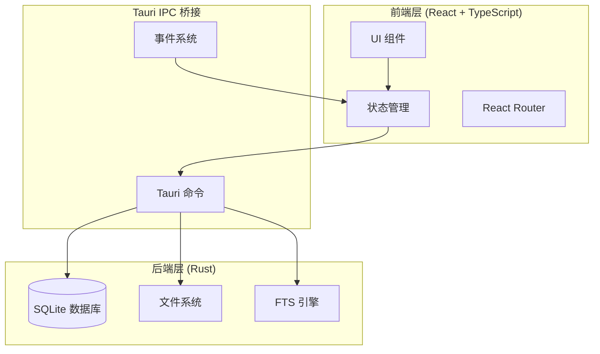

<div align="center">

# 🐾 刨刨日记 (Paw Diary)

**现代化宠物成长记录应用**

*记录宠物成长旅程中的每一个爪印*

[](https://github.com/wty92911/paw-diary)
[](./LICENSE)
[](https://tauri.app)
[](https://www.typescriptlang.org/)
[](https://www.rust-lang.org/)

[English](./README.md) | [简体中文](./README.zh-CN.md)

</div>

---

## 📖 目录

- [项目概览](#-项目概览)
- [功能特性](#-功能特性)
- [应用截图](#-应用截图)
- [功能演示](#-功能演示)
- [技术架构](#-技术架构)
- [快速开始](#-快速开始)
- [开发指南](#-开发指南)
- [产品路线图](#-产品路线图)
- [参与贡献](#-参与贡献)
- [开源协议](#-开源协议)

---

## 🌟 项目概览

**刨刨日记** 是一款精美的现代化桌面应用，帮助宠物主人追踪爱宠的成长、健康、饮食和日常活动。基于 Tauri 2.x、React 19 和 TypeScript 等前沿技术构建，结合了原生应用的性能和 Web 技术的灵活性。

### 为什么选择刨刨日记？

- **🎨 精美设计**：温馨的宠物主题界面，流畅的动画效果
- **📊 智能分析**：可视化展示成长趋势、健康记录和消费模式
- **🚀 极速体验**：Rust 后端和优化前端带来原生性能
- **🔒 隐私优先**：所有数据本地存储，无追踪无分析
- **🌐 跨平台**：在 macOS、Windows 和 Linux 上无缝运行

---

## ✨ 功能特性

### 🐶 多宠物管理

使用直观的卡片式界面轻松管理多个宠物。

- **丰富档案**：照片、名字、品种、生日和详细信息
- **快速切换**：流畅过渡效果的宠物无缝切换
- **智能上下文**：宠物专属的活动追踪和智能默认值
- **归档支持**：整理非活跃宠物而不丢失数据

<!-- 截图占位 -->
> 📸 **即将推出截图**：卡片式切换的宠物管理界面

---

### 📝 活动记录系统

使用创新的区块化架构记录宠物的日常活动。

#### 三种交互模式

1. **⚡ 快速记录** - 繁忙时刻，≤3 次点击完成记录
2. **🎯 引导流程** - 模板驱动的记录，带智能建议
3. **✏️ 高级编辑** - 完全自定义，支持富媒体

#### 15+ 可复用区块

- 📝 **标题和笔记**：支持格式化的富文本输入
- ⏰ **日期时间**：灵活的日期时间选择和预设
- 📏 **测量数据**：体重、身高、体温及单位转换
- 📷 **附件**：照片和视频的预览与管理
- 📍 **位置**：GPS 定位和场地搜索
- 🌤️ **天气**：自动集成天气数据
- 💰 **费用跟踪**：支持分类的消费记录
- 🏥 **医疗信息**：症状、药物和兽医就诊

<!-- 截图占位 -->
> 📸 **即将推出截图**：区块化编辑器的活动记录界面

<!-- 演示占位 -->
> 🎬 **即将推出演示**：快速记录交互流程（GIF）

---

### 📊 数据可视化与分析

将原始数据转化为可操作的洞察，配以精美的图表和统计。

- **📈 成长追踪**：体重趋势、身高测量、里程碑追踪
- **🏥 健康记录**：疫苗接种计划、病历、症状模式
- **🍖 饮食分析**：份量追踪、品牌偏好、喂养模式
- **💳 消费监控**：费用分类、消费趋势、预算洞察
- **📅 活动时间轴**：按时间顺序查看，智能过滤和分组

<!-- 截图占位 -->
> 📸 **即将推出截图**：带图表和分析的仪表板

---

### 🎨 精致的用户体验

每个交互都经过精心设计，追求最大的可用性和愉悦感。

#### 视觉设计系统

- **分类主题**：彩色编码系统与鲜艳渐变
  - 🔴 健康（红色）- 医疗和健康活动
  - 🔵 成长（蓝色）- 身体发育追踪
  - 🟢 饮食（绿色）- 喂养和营养
  - 🟣 生活（紫色）- 日常活动和玩耍
  - 🟠 消费（橙色）- 财务追踪

- **流畅动画**：Framer Motion 驱动的 60fps 过渡效果
- **性能优化**：虚拟化列表处理成千上万的活动
- **智能搜索**：全文搜索与智能过滤
- **响应式**：移动优先设计，跨平台兼容

<!-- 截图占位 -->
> 📸 **即将推出截图**：分类主题的活动时间轴

<!-- 演示占位 -->
> 🎬 **即将推出演示**：时间轴滚动和过滤（GIF）

---

### 🚀 智能功能

- **💾 自动保存草稿**：后台持久化，永不丢失工作内容
- **🧠 智能默认**：宠物专属建议和记忆偏好
- **📎 富媒体**：照片/视频附件的预览和管理
- **📤 导出分享**：活动摘要和健康报告
- **🔍 高级搜索**：所有活动和笔记的全文搜索

---

## 📸 应用截图

<!-- 主界面 -->
### 主屏幕
> 🖼️ **图片占位**：`docs/images/home-screen.png`
>
> *宠物选择和快捷操作仪表板*

<!-- 活动时间轴 -->
### 活动时间轴
> 🖼️ **图片占位**：`docs/images/activity-timeline.png`
>
> *分类过滤和搜索的时间顺序视图*

<!-- 记录界面 -->
### 活动记录
> 🖼️ **图片占位**：`docs/images/activity-recording.png`
>
> *带实时预览的区块化活动编辑器*

<!-- 分析仪表板 -->
### 分析仪表板
> 🖼️ **图片占位**：`docs/images/analytics-dashboard.png`
>
> *成长、健康和消费的图表与洞察*

<!-- 宠物档案 -->
### 宠物档案
> 🖼️ **图片占位**：`docs/images/pet-profile.png`
>
> *详细的宠物信息和设置*

---

## 🎬 功能演示

### 快速活动记录
> 🎥 **演示占位**：`docs/videos/quick-log-demo.gif`
>
> *3 次点击记录一次用餐活动*

### 时间轴导航
> 🎥 **演示占位**：`docs/videos/timeline-demo.gif`
>
> *流畅滚动和过滤活动*

### 数据可视化
> 🎥 **演示占位**：`docs/videos/charts-demo.gif`
>
> *展示成长趋势的交互式图表*

---

## 🏗️ 技术架构

### 技术栈

<table>
<tr>
<td width="50%" valign="top">

#### 前端
- **框架**：React 19.1 + TypeScript 5.8
- **UI 库**：Shadcn UI + Radix UI
- **样式**：TailwindCSS 与设计令牌
- **表单**：React Hook Form + Zod 验证
- **动画**：Framer Motion
- **虚拟化**：TanStack React Virtual
- **路由**：React Router DOM v7
- **状态**：TanStack Query 服务端状态

</td>
<td width="50%" valign="top">

#### 后端
- **运行时**：Tauri 2.x + Rust 1.80
- **数据库**：SQLite + SQLx 0.8
- **搜索**：全文搜索（FTS5）
- **API**：Tauri IPC 命令
- **文件存储**：自定义 photos 协议
- **验证**：多层验证（Zod + Rust）

</td>
</tr>
</table>

### 系统架构



### 核心设计模式

- **区块化架构**：可组合、可复用的输入组件
- **命令查询分离**：清晰的 Tauri 命令组织
- **离线优先**：本地存储，计划支持云同步
- **多层验证**：从 UI 到数据库的类型安全
- **智能/哑组件**：明确的关注点分离

📚 **详细文档**：查看 [架构文档](./docs/architecture.md)

---

## 🚀 快速开始

### 前置要求

- **Node.js** v18+ ([下载](https://nodejs.org/))
- **Rust** 最新稳定版 ([安装](https://www.rust-lang.org/tools/install))
- **Yarn** 包管理器 ([安装](https://yarnpkg.com/getting-started/install))
- **平台特定工具**：
  - macOS: Xcode 命令行工具
  - Windows: Microsoft Visual Studio C++ 生成工具
  - Linux: 构建必需工具（`build-essential`、`libssl-dev`、`libgtk-3-dev`）

### 快速开始

```bash
# 克隆仓库
git clone https://github.com/wty92911/paw-diary.git
cd paw-diary

# 安装依赖
yarn install

# 启动开发服务器
yarn tauri dev
```

应用程序将自动在桌面上启动。

### 生产构建

```bash
# 构建优化的桌面应用
yarn tauri build

# 输出位置：
# - macOS: src-tauri/target/release/bundle/dmg/
# - Windows: src-tauri/target/release/bundle/msi/
# - Linux: src-tauri/target/release/bundle/appimage/
```

---

## 🛠️ 开发指南

### 项目结构

```
paw-diary/
├── src/                          # 前端源代码
│   ├── components/              # React 组件
│   │   ├── activities/         # 活动记录系统
│   │   ├── ui/                 # 可复用 UI 组件（Shadcn）
│   │   └── header/             # 通用头部系统
│   ├── lib/                    # 工具和辅助函数
│   │   ├── types/              # TypeScript 类型定义
│   │   ├── summary/            # 智能事实提取
│   │   └── utils/              # 通用工具
│   └── App.tsx                 # 根组件
├── src-tauri/                  # Rust 后端
│   ├── src/
│   │   ├── database/          # SQLite 操作
│   │   ├── commands/          # Tauri 命令处理器
│   │   └── lib.rs             # 主库入口
│   └── tauri.conf.json        # Tauri 配置
├── docs/                       # 文档
│   ├── product.md             # 产品文档
│   └── architecture.md        # 技术架构
└── specs/                      # 产品规格
    ├── 0001-prd.md           # 产品需求
    └── 001-ios-app-header/   # 功能规格
```

### 开发命令

```bash
# 前端开发
yarn dev              # 启动 Vite 开发服务器（端口 1420）
yarn build            # 构建生产前端
yarn preview          # 预览生产构建

# 桌面应用
yarn tauri dev        # 以开发模式启动 Tauri
yarn tauri build      # 构建生产桌面应用
yarn tauri icon       # 从源生成应用图标

# 移动开发（iOS）
yarn ios:dev          # 启动 iOS 开发模式
yarn ios:build        # 构建 iOS 应用

# 代码质量
yarn format           # 使用 Prettier 格式化代码
yarn lint             # 运行 ESLint 检查
yarn lint:fix         # 自动修复 ESLint 问题
yarn typecheck        # 运行 TypeScript 类型检查

# 测试
yarn test             # 使用 Vitest 运行测试
yarn test:ui          # 使用 UI 运行测试
yarn test:coverage    # 生成覆盖率报告
```

### 开发工作流

1. **功能开发**：从 `main` 创建功能分支
2. **实现**：遵循 TypeScript 严格模式和 ESLint 规则
3. **测试**：为组件和工具编写单元测试
4. **类型安全**：确保完整的 TypeScript 覆盖
5. **代码审查**：提交带详细描述的 PR
6. **CI/CD**：自动化测试和构建验证

### 代码规范

- **TypeScript**：严格模式，无隐式 any
- **ESLint**：React、可访问性和最佳实践规则
- **Prettier**：一致的代码格式
- **提交**：约定式提交格式与表情符号
  ```
  ✨ feat: 添加新功能
  🐛 fix: 修复错误
  📝 docs: 更新文档
  ♻️ refactor: 重构代码
  ✅ test: 添加测试
  🎨 style: 更新样式
  ```

---

## 🎯 产品路线图

### ✅ M1：基础（已完成）
- [x] Tauri + React + TypeScript 搭建
- [x] 宠物管理系统（CRUD 操作）
- [x] 基础活动记录
- [x] SQLite 数据库集成

### ✅ M2：活动系统重构（已完成）
- [x] 区块化活动架构（15+ 区块）
- [x] 三种交互模式（快速记录、引导流程、高级编辑）
- [x] 60fps 性能的虚拟化时间轴
- [x] 分类主题和视觉设计系统
- [x] 智能搜索和过滤
- [x] 照片附件系统

### 🔄 M3：数据可视化（进行中）
- [ ] 交互式图表（成长、健康、饮食趋势）
- [ ] 统计洞察和模式识别
- [ ] 报告导出功能
- [ ] 带关键指标和提醒的仪表板
- [ ] 可自定义图表配置

### 📅 M4：云同步与提醒（2025 年 Q2）
- [ ] 用户认证系统
- [ ] 多设备同步
- [ ] 云备份和恢复
- [ ] 智能提醒（疫苗接种、用药）
- [ ] 家庭共享宠物档案

### 🤖 M5：AI 集成（2025 年 Q3）
- [ ] 自然语言活动输入
- [ ] 智能健康洞察和建议
- [ ] 自动活动分类
- [ ] 预测性健康监测
- [ ] 基于照片的食物识别

### 🌍 未来愿景（2025+）
- [ ] 移动应用（iOS/Android 原生）
- [ ] 兽医诊所集成
- [ ] 社区功能和宠物社交网络
- [ ] 电商集成（宠物用品）
- [ ] 多语言支持（英语、中文、日语）

---

## 🤝 参与贡献

我们欢迎社区贡献！无论是错误修复、新功能还是文档改进，您的帮助都能让刨刨日记变得更好。

### 如何贡献

1. **Fork** 仓库
2. **克隆** 您的 fork 到本地
3. **创建** 功能分支（`git checkout -b feature/amazing-feature`）
4. **进行** 更改，遵循代码规范
5. **测试** 您的更改
6. **提交** 使用约定式提交格式（`git commit -m '✨ feat: 添加惊艳功能'`）
7. **推送** 到您的 fork（`git push origin feature/amazing-feature`）
8. **提交** 带详细描述的 Pull Request

### 贡献者开发设置

```bash
# Fork 并克隆仓库
git clone https://github.com/YOUR_USERNAME/paw-diary.git
cd paw-diary

# 添加上游远程
git remote add upstream https://github.com/wty92911/paw-diary.git

# 创建功能分支
git checkout -b feature/your-feature-name

# 安装依赖
yarn install

# 开始开发
yarn tauri dev
```

### 贡献指南

- 遵循现有的代码风格和模式
- 编写有意义的提交信息
- 为新功能添加测试
- 根据需要更新文档
- 提交 PR 前确保所有测试通过
- 在讨论中保持尊重和建设性

### 贡献领域

- 🐛 **错误修复**：帮助我们消除 bug
- ✨ **新功能**：实现路线图中的项目
- 📝 **文档**：改进文档，添加翻译
- 🎨 **设计**：UI/UX 改进和新主题
- ⚡ **性能**：优化和效率提升
- 🧪 **测试**：增加测试覆盖率

---

## 📱 平台支持

| 平台 | 状态 | 架构 | 分发 |
|----------|--------|--------------|--------------|
| **macOS** | ✅ 稳定 | 通用（Intel + Apple Silicon） | DMG、App Store |
| **Windows** | ✅ 稳定 | x64、ARM64 | MSI、Microsoft Store |
| **Linux** | ✅ 稳定 | x64、ARM64 | AppImage、Snap、deb |
| **iOS** | 🚧 测试版 | ARM64 | TestFlight |
| **Android** | 📅 计划中 | ARM64、ARMv7 | APK、Play Store |

### 系统要求

**最低配置**：
- 系统：macOS 10.15+ / Windows 10+ / Ubuntu 20.04+
- 内存：4GB
- 存储：200MB + 数据存储
- 显示器：1280x720

**推荐配置**：
- 系统：最新稳定版本
- 内存：8GB+
- 存储：500MB + 数据存储
- 显示器：1920x1080 或更高

---

## 📊 性能指标

我们对性能的承诺确保流畅体验：

- **⚡ 时间轴渲染**：1000+ 活动 <100ms
- **📦 打包大小**：初始 <500KB，总计 <2MB
- **🎬 动画性能**：稳定 60fps
- **💾 数据库查询**：平均响应 <50ms
- **🔍 搜索性能**：全文搜索 <200ms
- **🚀 应用启动**：冷启动 <2s，热启动 <1s

---

## 🛡️ 安全与隐私

您宠物的数据属于您，并且永远属于您。

- **🔒 本地优先**：默认所有数据本地存储
- **🚫 无追踪**：零分析或用户追踪
- **🔐 数据加密**：敏感数据加密保护
- **🌐 开源**：透明和可审计的代码库
- **🔄 数据可移植性**：随时导出标准格式数据
- **🛡️ 隐私设计**：GDPR 和隐私优先架构

---

## 🧪 测试

### 测试覆盖

- **单元测试**：组件、工具、业务逻辑
- **集成测试**：Tauri 命令、数据库操作
- **E2E 测试**：用户工作流和关键路径
- **性能测试**：时间轴虚拟化、动画性能

### 运行测试

```bash
# 运行所有测试
yarn test

# 运行覆盖率测试
yarn test:coverage

# 使用 UI 运行
yarn test:ui

# 运行特定测试文件
yarn test src/components/activities/ActivityCard.test.tsx
```

### 测试策略

- **单元测试**：Vitest + React Testing Library
- **集成测试**：Tauri 测试工具
- **性能测试**：自定义基准测试
- **目标覆盖率**：关键路径 70%+

---

## 📄 开源协议

本项目基于 **MIT 协议** 开源 - 详见 [LICENSE](./LICENSE) 文件。

### 这意味着什么

- ✅ 个人和商业项目免费使用
- ✅ 随意修改和分发
- ✅ 无保证或责任
- ✅ 必须包含许可证和版权声明

---

## 🙏 致谢

刨刨日记建立在巨人的肩膀上。特别感谢：

- **[Tauri 团队](https://tauri.app)**：出色的跨平台框架
- **[Shadcn](https://ui.shadcn.com)**：精美的 UI 组件库
- **[React 团队](https://react.dev)**：强大的前端框架
- **[Rust 社区](https://www.rust-lang.org)**：快速安全的语言
- **[TanStack](https://tanstack.com)**：强大的 React 库
- **[Radix UI](https://www.radix-ui.com)**：无障碍原语
- **[Tailwind CSS](https://tailwindcss.com)**：实用优先的 CSS 框架

以及所有帮助改进这个项目的[贡献者](https://github.com/wty92911/paw-diary/graphs/contributors)！💖

---

## 📞 支持与社区

### 获取帮助

- **📚 文档**：[产品文档](./docs/product.md) | [架构文档](./docs/architecture.md)
- **🐛 报告问题**：[GitHub Issues](https://github.com/wty92911/paw-diary/issues)
- **💬 讨论**：[GitHub Discussions](https://github.com/wty92911/paw-diary/discussions)
- **📧 邮箱**：support@pawdiary.com

### 保持联系

- **🌟 Star** 此仓库以表示支持
- **👁️ Watch** 获取更新和新版本
- **🔀 Fork** 开始贡献
- **📢 分享** 给其他宠物爱好者

### 社区准则

- 保持尊重和包容
- 帮助他人学习和成长
- 分享您的经验和反馈
- 报告错误并提出改进建议
- 贡献代码、文档或翻译

---

<div align="center">

## 🌟 Star 历史

[](https://star-history.com/#wty92911/paw-diary&Date)

---

## 💖 用爱制作

**为全世界的宠物家长用 ❤️ 打造**

*记录宠物成长旅程中的每一个爪印* 🐾

---

### 快速链接

[功能特性](#-功能特性) • [应用截图](#-应用截图) • [快速开始](#-快速开始) • [产品路线图](#-产品路线图) • [参与贡献](#-参与贡献)

---

**© 2024 刨刨日记。保留所有权利。**

</div>
