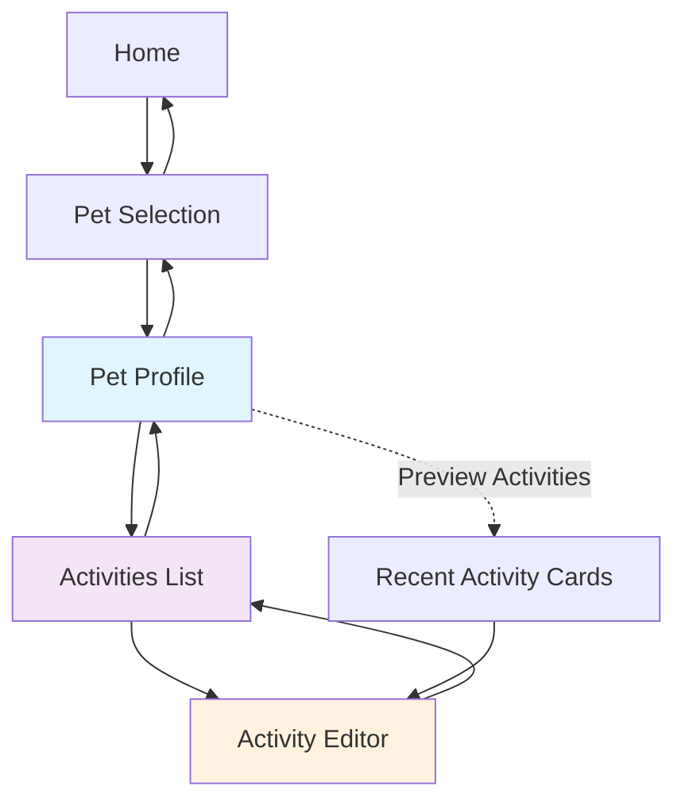
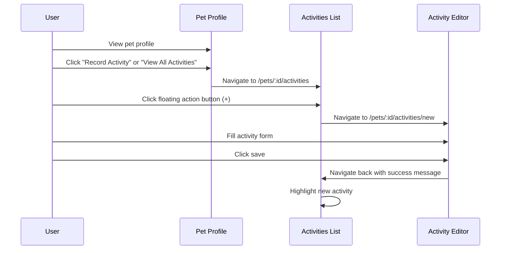
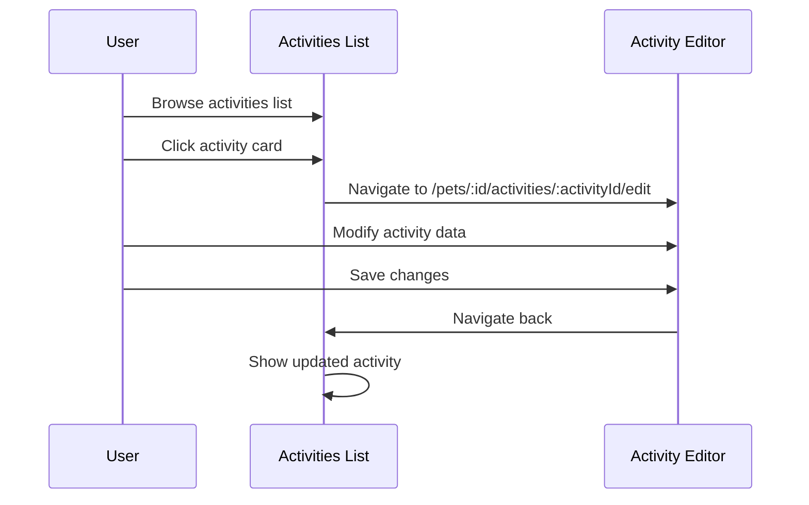
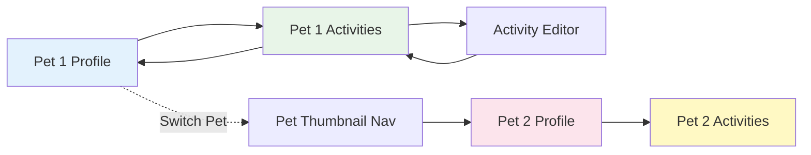

# Activity Pages Feature Documentation

## Overview

The Activity Pages feature transforms Paw Diary's activity management system from embedded components within pet profiles into dedicated, full-featured pages. This provides a clearer user experience with dedicated space for activity management, better navigation flow, and improved context awareness.

## 🎯 Feature Goals

- **Clear Context**: Activities are always bound to a specific pet with visual context
- **Dedicated Space**: Full-screen editing and browsing without profile distractions  
- **Improved Navigation**: Logical flow between pet profiles, activity lists, and editors
- **Better Organization**: Enhanced filtering, sorting, and timeline management
- **Consistent Experience**: Unified interface across all activity operations

## 📱 Page Architecture

The Activity Pages feature introduces three core pages that work together:

```
┌─────────────────┐    View All Activities    ┌─────────────────┐
│  Pet Profile    │ ────────────────────────► │ Activities List │
│  (Simplified)   │                           │     Page        │
└─────────────────┘                           └─────────────────┘
                                                      │
                                                      │ Create/Edit
                                                      ▼
                                              ┌─────────────────┐
                                              │ Activity Editor │
                                              │     Page        │
                                              └─────────────────┘
```

## 🗺️ Navigation Flow

### URL Structure

The new routing patterns provide clear, bookmarkable URLs:

```
/pets/:petId                           # Pet profile with activity previews
/pets/:petId/activities               # Full activities list for pet
/pets/:petId/activities/new           # Create new activity
/pets/:petId/activities/:id/edit      # Edit existing activity
```

### Query Parameters for Editor

Activity editor supports configuration via URL parameters:

```
# Quick mode with template
/pets/123/activities/new?mode=quick&template=feeding

# Guided mode (default)
/pets/123/activities/new?mode=guided

# Advanced mode for power users
/pets/123/activities/new?mode=advanced

# Edit with specific mode
/pets/123/activities/456/edit?mode=advanced
```

### Navigation Hierarchy



## 📄 Page Descriptions

### 1. Pet Profile Page (Updated)

**Route:** `/pets/:petId`

**Purpose:** Simplified pet information display with activity previews

**Key Features:**
- Focus on basic pet information (name, photo, breed, birth date)
- Preview of 1-3 most recent activities
- Prominent "View All Activities" button
- Quick access to create new activity
- Pet thumbnail navigation for switching pets

**What Changed:**
- ✅ Removed full activity timeline (now in dedicated page)
- ✅ Removed complex activity filtering (now in activities list)
- ✅ Added activity preview cards with limited data
- ✅ Added clear navigation to activities list

### 2. Activities List Page (New)

**Route:** `/pets/:petId/activities`

**Purpose:** Dedicated page for viewing and managing all pet activities

**Key Features:**
- **Pet Context Header**: Shows current pet with back navigation
- **Activity Timeline**: Chronological list of all activities (newest first)
- **Advanced Filtering**: 
  - Category filters (Health, Growth, Diet, Lifestyle, Expense)
  - Date range selection
  - Attachment presence filter
- **Sort Controls**: Toggle between newest/oldest first
- **Search Functionality**: Text search across activity titles and descriptions
- **Floating Action Button**: Quick access to create new activity
- **Activity Cards**: Click to edit, long-press for context menu

**User Interactions:**
```
┌─ Activity Card ─┐
│  [Photo] Title  │ ← Click to edit
│  Category • Date│ ← Long-press for menu
│  Key Facts      │   (Edit, Delete, Duplicate)
└─────────────────┘
```

### 3. Activity Editor Page (New)

**Route:** `/pets/:petId/activities/new` or `/pets/:petId/activities/:id/edit`

**Purpose:** Full-screen activity creation and editing

**Key Features:**
- **Pet Context Header**: Current pet info with back navigation
- **Full ActivityEditor Component**: All existing editing capabilities
- **Three Editing Modes**: Quick, Guided, Advanced (via URL params)
- **Template Support**: Pre-populate with activity templates
- **Draft Auto-Save**: Automatic saving every 30 seconds
- **Save & Navigation**: Return to activities list after save
- **Cancel Confirmation**: Prompt if unsaved changes exist

**Editor Mode Differences:**
- **Quick Mode**: Essential fields only, minimal UI
- **Guided Mode**: Step-by-step with helpful hints (default)
- **Advanced Mode**: All fields visible, expert interface

## 🔄 User Workflows

### Creating a New Activity



### Editing Existing Activity



### Multi-Pet Management



## 🎨 User Interface Components

### Pet Context Header

Appears on all activity pages to maintain context:

```
┌─────────────────────────────────────────────┐
│ [←] [Pet Photo] Max's Activities   [•••]    │
│     Golden Retriever • 2 years old         │
└─────────────────────────────────────────────┘
```

**Features:**
- Back button (returns to previous page)
- Pet photo and name
- Pet details (breed, age)
- Options menu (future: pet switching)

### Activity Timeline

Enhanced timeline component with filtering:

```
┌─ Filters ─────────────────────────────────┐
│ [All] [Health] [Growth] [Diet] [•••]      │
│ [📅 Date Range] [📎 With Photos] [Sort ↓] │
└───────────────────────────────────────────┘

┌─ Activity Card ────────────────────────────┐
│ [📸] Morning Walk                          │
│ Lifestyle • 2 hours ago                   │
│ Duration: 30min • Location: Central Park  │
│ 📎 2 photos                               │
└───────────────────────────────────────────┘
```

### Floating Action Button

Consistent "+" button for creating activities:

```
                                    ┌─────┐
                                    │  +  │ ← Always visible
                                    │     │   Quick create
                                    └─────┘
```

## ⚡ Performance Optimizations

### Virtual Scrolling

For large activity lists (500+ activities):
- Only render visible activity cards
- Smooth scrolling performance
- Memory efficient for thousands of entries

### Lazy Loading

Optimized resource loading:
- Activity images loaded on demand
- Attachment thumbnails loaded when visible
- Editor components split by route

### Caching Strategy

Smart data management:
- React Query caches activities per pet
- Pet context cached across page navigation
- Draft data persisted locally
- Automatic cache invalidation on updates

## 🛠️ Technical Implementation

### TypeScript Interfaces

Key interfaces for type safety:

```typescript
// Route parameters
interface PetActivityRouteParams {
  petId: string;
  activityId?: string;
}

// Query parameters
interface ActivityEditorQueryParams {
  template?: string;
  mode?: ActivityMode;
}

// Page component props
interface ActivitiesListPageProps {
  petId: string;
}

interface ActivityEditorPageProps {
  petId: string;
  activityId?: string;
  mode?: ActivityMode;
  templateId?: string;
}
```

### State Management

Activities list state with filtering:

```typescript
interface ActivitiesListState {
  activities: ActivityTimelineItem[];
  filteredActivities: ActivityTimelineItem[];
  selectedFilters: {
    categories: ActivityCategory[];
    dateRange?: { start: Date; end: Date };
    hasAttachments?: boolean;
  };
  sortOrder: 'desc' | 'asc';
  isLoading: boolean;
  error?: string;
}
```

### Navigation Utilities

Type-safe navigation helpers:

```typescript
// Navigation functions
const useActivityNavigation = () => ({
  toActivitiesList: (petId: string) => navigate(`/pets/${petId}/activities`),
  toNewActivity: (petId: string, params?: ActivityEditorQueryParams) => {
    const query = new URLSearchParams();
    if (params?.template) query.set('template', params.template);
    if (params?.mode) query.set('mode', params.mode);
    navigate(`/pets/${petId}/activities/new?${query}`);
  },
  toEditActivity: (petId: string, activityId: string) => 
    navigate(`/pets/${petId}/activities/${activityId}/edit`),
});
```

## 🔒 Security & Data Integrity

### Pet Context Validation

All activity operations validate pet ownership:

```rust
// Backend validation
pub async fn create_activity(pet_id: i64, activity_data: ActivityCreateRequest) {
    // Verify pet exists and is accessible
    let pet = sqlx::query!("SELECT id FROM pets WHERE id = ?", pet_id)
        .fetch_optional(&pool)
        .await?
        .ok_or(PetError::PetNotFound { id: pet_id })?;
    
    // Proceed with activity creation
}
```

### Input Sanitization

- All form inputs validated with Zod schemas
- Photo uploads restricted by type and size
- Activity data sanitized before storage
- Draft data scoped to prevent cross-pet leakage

## 📱 Mobile Responsiveness

### Responsive Design

**Desktop (1024px+):**
- Full-width activity lists
- Side-by-side filters
- Keyboard shortcuts support

**Tablet (768px - 1023px):**
- Collapsible filter sidebar
- Touch-optimized interactions
- Hybrid keyboard/touch support

**Mobile (< 768px):**
- Stacked layouts
- Bottom sheet filters
- Touch-first interactions
- Swipe gestures for navigation

### Touch Interactions

```
Activity Card Gestures:
├── Tap → Navigate to editor
├── Long Press → Context menu (Edit, Delete, Duplicate)
└── Swipe Left → Quick actions (future)

Navigation:
├── Swipe from left edge → Back navigation
├── Pull to refresh → Reload activities
└── Swipe down → Dismiss editor/filters
```

## 🧪 Testing Strategy

### Unit Testing

**Page Components:**
- Route parameter extraction
- Pet context loading
- Error state handling
- Navigation behavior

**State Management:**
- Filter application logic
- Sort functionality
- Search operations
- Loading states

### Integration Testing

**Navigation Flow:**
```
Pet Profile → Activities List → Activity Editor → Save → Back to List
```

**Cross-Pet Switching:**
- Switch pets via thumbnail navigation
- Verify activity lists update correctly
- Maintain separate filter states per pet

### End-to-End Testing

**Complete User Journey:**
1. Select pet from homepage
2. View pet profile with activity previews
3. Navigate to full activities list
4. Apply various filters and search
5. Create new activity with all editor modes
6. Edit existing activity
7. Verify data persistence
8. Test draft recovery after navigation

## 🚨 Troubleshooting Guide

### Common Issues

#### 1. Activity List Not Loading

**Symptoms:**
- Activities list page shows loading spinner indefinitely
- Error message: "Failed to load activities"

**Possible Causes:**
- Invalid pet ID in URL
- Network connectivity issues
- Backend service unavailable

**Solutions:**
```bash
# Check browser console for errors
# Verify pet ID exists: /pets/123/activities
# Try refreshing the page
# Check network tab for failed requests
```

#### 2. Pet Context Lost

**Symptoms:**
- Pet header shows "Loading..." permanently
- Activities appear for wrong pet
- Navigation buttons don't work

**Possible Causes:**
- Corrupted URL parameters
- Cache inconsistency
- Browser back/forward navigation issues

**Solutions:**
```typescript
// Clear React Query cache
queryClient.invalidateQueries(['pet']);
queryClient.invalidateQueries(['activities']);

// Navigate to pet profile and back
navigate(`/pets/${petId}`);
```

#### 3. Activity Editor Crashes

**Symptoms:**
- White screen when opening editor
- Error boundary triggered
- Form validation errors

**Possible Causes:**
- Invalid activity data
- Missing required fields
- Template configuration errors

**Solutions:**
```typescript
// Check activity data structure
console.log('Activity data:', activityData);

// Verify template exists
const template = getTemplate(templateId);
if (!template) {
  // Handle missing template
}

// Reset form state
reset(defaultValues);
```

#### 4. Draft Recovery Issues

**Symptoms:**
- Drafts not saving automatically
- Lost work after navigation
- Draft recovery prompt not showing

**Possible Causes:**
- Local storage full or disabled
- Pet context mismatch
- Draft cleanup conflicts

**Solutions:**
```typescript
// Check local storage
console.log('Draft storage:', localStorage.getItem(`draft_${petId}_${templateId}`));

// Manually save draft
await saveDraft(petId, templateId, formData);

// Clear corrupted drafts
localStorage.removeItem(`draft_${petId}_${templateId}`);
```

### Debug Information

For support requests, include:

```
Browser: Chrome 91.0.4472.124
Device: Desktop/Mobile/Tablet
Pet ID: 123
Activity ID: 456 (if applicable)
Template ID: feeding (if applicable)
Error Message: [exact error text]
Steps to Reproduce: [detailed steps]
Console Errors: [copy from browser console]
```

## 🔮 Future Enhancements

### Short Term (Next Release)

- **Batch Operations**: Select multiple activities for bulk actions
- **Activity Templates**: Custom template creation and management
- **Enhanced Search**: Search within activity descriptions and notes
- **Activity Duplication**: Copy activities with modified timestamps

### Medium Term (2-3 Releases)

- **Activity Categories**: Custom category creation and management
- **Export/Import**: Export activity data to various formats
- **Activity Statistics**: Charts and insights from activity data
- **Reminder Integration**: Link activities to reminders and schedules

### Long Term (Future Versions)

- **AI Insights**: Activity pattern analysis and suggestions
- **Multi-Pet Comparisons**: Compare activities across pets
- **Veterinary Integration**: Share activities with vet systems
- **Community Features**: Share activity templates and insights

## 📚 Related Documentation

- [Activity System Architecture](./activity-system.md)
- [Component API Reference](./components/activities.md)
- [TypeScript Interfaces](../src/lib/types/activities.ts)
- [Testing Guidelines](./testing/activity-pages.md)
- [Performance Best Practices](./performance/optimization.md)

## 🤝 Contributing

When working on activity pages:

1. **Maintain Context Awareness**: Always show current pet context
2. **Preserve Navigation Stack**: Back buttons should behave predictably
3. **Handle Loading States**: Show appropriate feedback during operations
4. **Error Boundaries**: Graceful handling of component failures
5. **Mobile First**: Design for touch interactions first
6. **Performance**: Consider virtual scrolling for large lists
7. **Accessibility**: Keyboard navigation and screen reader support

## 📝 Changelog

### Version 1.0.0 (Initial Release)
- ✅ Dedicated activities list page
- ✅ Full-screen activity editor
- ✅ Pet context headers
- ✅ URL routing and navigation
- ✅ Activity filtering and search
- ✅ Draft auto-save functionality
- ✅ Mobile responsive design
- ✅ TypeScript interface documentation

---

*For technical questions or issues, please refer to the troubleshooting guide or contact the development team.*