# Paw Diary Technical Architecture Documentation

**Version:** 1.0.0
**Last Updated:** 2025-10-02
**Application Version:** 0.1.0

## Table of Contents

1. [System Architecture Overview](#system-architecture-overview)
2. [Frontend Architecture](#frontend-architecture)
3. [Backend Architecture](#backend-architecture)
4. [Data Architecture](#data-architecture)
5. [Key Design Patterns](#key-design-patterns)
6. [Development Workflow](#development-workflow)
7. [Future Architecture Plans](#future-architecture-plans)

---

## 1. System Architecture Overview

### 1.1 High-Level Architecture

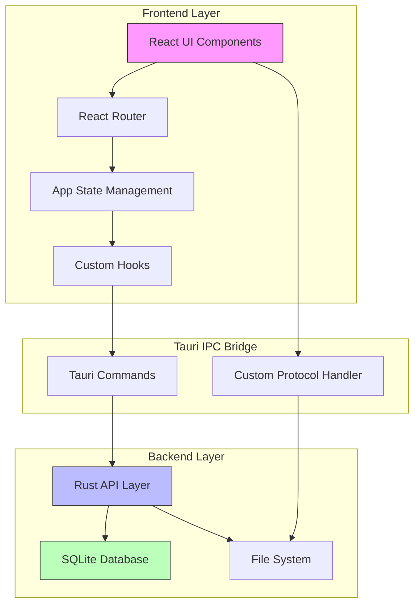

### 1.2 Technology Stack

| Layer | Technologies |
|-------|-------------|
| **Desktop Framework** | Tauri 2.x |
| **Frontend** | React 19.1, TypeScript 5.8, Vite 7.0 |
| **UI Components** | Shadcn UI, Radix UI, TailwindCSS 3.4 |
| **State Management** | React Query (@tanstack/react-query 5.x), React Hooks |
| **Routing** | React Router 7.8 |
| **Backend Runtime** | Rust (async runtime: Tokio) |
| **Database** | SQLite with SQLx 0.8 |
| **Image Processing** | Rust image crate 0.25 |
| **Validation** | Zod (Frontend), thiserror (Backend) |

### 1.3 Application Structure

```
paw-diary/
├── src/                    # Frontend (React/TypeScript)
│   ├── components/        # UI components
│   ├── hooks/             # Custom React hooks
│   ├── lib/               # Utilities and types
│   ├── pages/             # Route pages
│   └── App.tsx            # Main app component
│
├── src-tauri/             # Backend (Rust)
│   ├── src/
│   │   ├── commands/      # Tauri command handlers
│   │   ├── database/      # Database logic
│   │   ├── errors/        # Error types
│   │   └── validation/    # Data validation
│   ├── migrations/        # SQL migrations
│   └── Cargo.toml         # Rust dependencies
│
└── specs/                 # Product requirements & designs
```

---

## 2. Frontend Architecture

### 2.1 Component Architecture

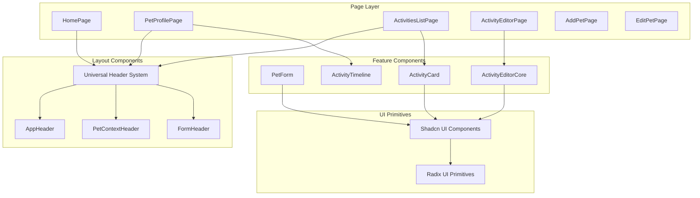

**Key Design Decisions:**

- **Universal Header System** (see `src/components/header/`): iOS-style adaptive header with variants for different contexts
- **Composition over Inheritance**: Components use React hooks and composition patterns
- **Smart/Dumb Component Pattern**: Pages handle data fetching, components handle presentation

### 2.2 State Management

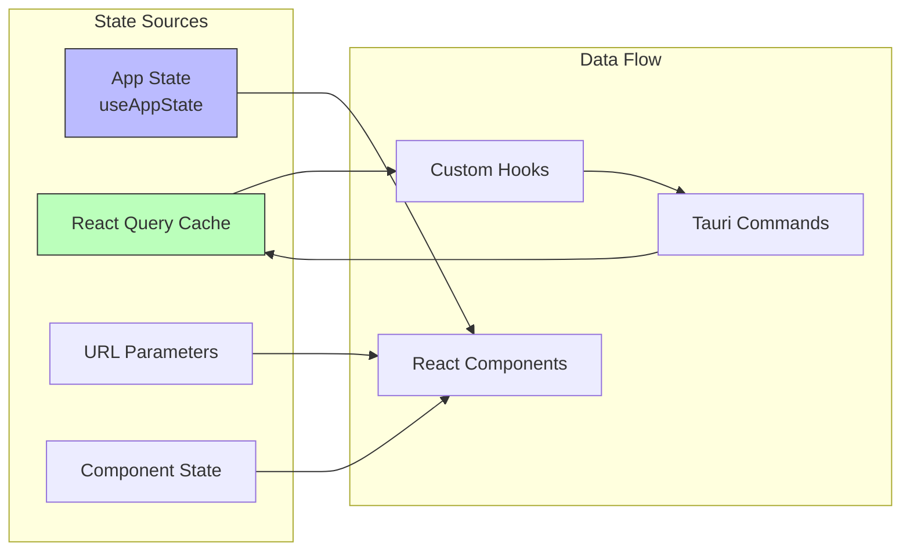

**State Management Patterns:**

1. **Global App State** (`src/hooks/useAppState.ts`):
   - Initialization state
   - Error boundaries
   - Application-wide settings

2. **Server State** (React Query):
   - Pet data caching
   - Activity timeline
   - Photo metadata
   - Automatic background refetching

3. **URL State** (React Router):
   - Active pet ID
   - Activity filters
   - Navigation state

4. **Local Component State**:
   - Form inputs
   - UI toggles
   - Transient UI state

### 2.3 Routing Architecture

**Route Structure** (see `src/App.tsx:107-127`):

```typescript
// Core Routes
/                                    → HomePage (pet selection)
/pets/new                           → AddPetPage
/pets/:petId                        → PetProfilePage
/pets/:petId/edit                   → EditPetPage

// Activity Routes
/pets/:petId/activities             → ActivitiesListPage
/pets/:petId/activities/new         → ActivityEditorPage
/pets/:petId/activities/:id/edit    → ActivityEditorPage
```

**Navigation Patterns:**
- Pet-centric URL structure for deep linking
- Bookmarkable URLs for all major states
- Automatic redirection for 404s
- Context preservation across navigation

### 2.4 Build Configuration

**Vite Configuration** (`vite.config.ts:8-32`):

```typescript
{
  plugins: [react()],
  server: {
    port: 1420,           // Fixed for Tauri
    strictPort: true,
    hmr: { port: 1421 },
    watch: {
      ignored: ["**/src-tauri/**"]
    }
  }
}
```

**Key Features:**
- Hot Module Replacement (HMR) for rapid development
- TypeScript compilation with strict mode
- TailwindCSS JIT compilation
- Tree-shaking for production builds

---

## 3. Backend Architecture

### 3.1 Tauri Architecture

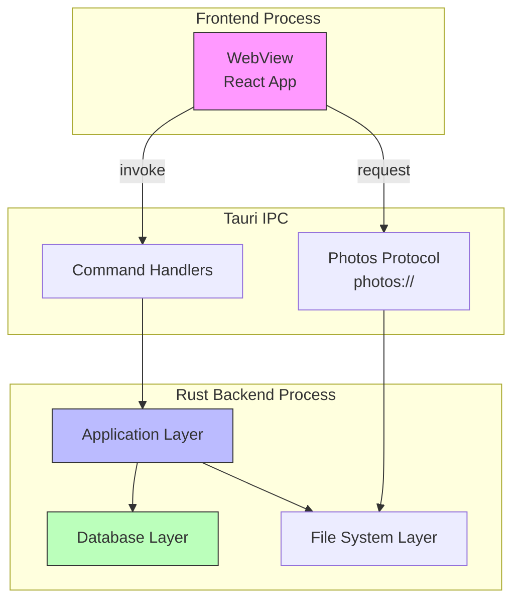

### 3.2 Module Organization

**Backend Module Structure** (`src-tauri/src/lib.rs:1-8`):

```rust
pub mod commands;      // Tauri command handlers
pub mod database;      // Database operations
pub mod errors;        // Error types and handling
pub mod logger;        // Logging configuration
pub mod photo;         // Photo management
pub mod protocol;      // Custom protocol handlers
pub mod validation;    // Input validation
```

### 3.3 Command Handlers

**Registered Commands** (`src-tauri/src/lib.rs:23-49`):

| Category | Commands | Description |
|----------|----------|-------------|
| **App Lifecycle** | `initialize_app`, `get_app_statistics` | App initialization and stats |
| **Pet Management** | `create_pet`, `get_pets`, `get_pet_by_id`, `update_pet`, `delete_pet`, `reorder_pets` | CRUD operations for pets |
| **Photo Management** | `upload_pet_photo`, `upload_pet_photo_from_path`, `delete_pet_photo`, `get_pet_photo_info`, `list_pet_photos`, `get_photo_storage_stats` | Photo upload and management |
| **Activity Management** | `create_activity`, `update_activity`, `get_activity`, `get_activities_for_pet`, `delete_activity` | Activity CRUD operations |

**Command Pattern Example:**

```rust
#[tauri::command]
async fn create_pet(
    request: CreatePetRequest,
    state: State<'_, AppState>
) -> Result<Pet, PetError> {
    // Validation → Database → Response
    validate_pet(&request)?;
    database::pets::create(&state.db, request).await
}
```

### 3.4 Custom Protocol Handler

**Photos Protocol** (`src-tauri/src/lib.rs:50-61`):

```rust
.register_asynchronous_uri_scheme_protocol("photos", |app, request, responder| {
    // Handles requests like: photos://pet_123.jpg
    match protocol::handle_photos_protocol_request(&app, request).await {
        Ok(response) => responder.respond(response),
        Err(e) => responder.respond(404_response)
    }
})
```

**Purpose:** Secure photo access without exposing file system paths to frontend

### 3.5 Error Handling Strategy

**Error Type Hierarchy:**

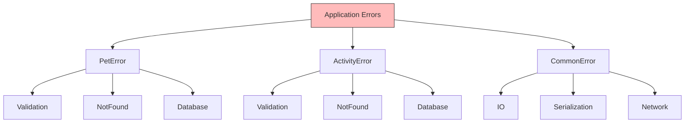

**Error Modules:**
- `src-tauri/src/errors/pet.rs` - Pet-specific errors
- `src-tauri/src/errors/activity.rs` - Activity errors
- `src-tauri/src/errors/common.rs` - Common errors

**Pattern:** Using `thiserror` for ergonomic error handling with automatic `From` implementations

---

## 4. Data Architecture

### 4.1 Database Schema

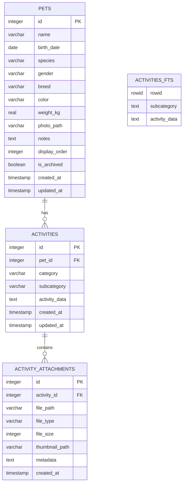

### 4.2 Data Models

**Core Data Structures** (see `src-tauri/src/database/models.rs`):

1. **Pet Model** (lines 6-22):
   - Primary entity for pet information
   - Includes ordering and archival support
   - Timestamped for audit trails

2. **Activity Model** (lines 112-121):
   - Polymorphic design with JSON `activity_data` field
   - Category-based classification
   - Full-text search enabled

3. **Enums:**
   - `PetSpecies`: Cat, Dog (lines 25-50)
   - `PetGender`: Male, Female, Unknown (lines 53-81)
   - `ActivityCategory`: Health, Growth, Diet, Lifestyle, Expense (lines 124-158)

### 4.3 Database Layer Architecture

**Database Module** (`src-tauri/src/database/mod.rs:12-41`):

```rust
pub struct PetDatabase {
    pub pool: SqlitePool,  // Connection pool
}

impl PetDatabase {
    // WAL mode for better concurrency
    // Normal synchronous for performance
    pub async fn new(path: &Path) -> Result<Self> {
        let options = SqliteConnectOptions::from_str(url)?
            .create_if_missing(true)
            .journal_mode(SqliteJournalMode::Wal)
            .synchronous(SqliteSynchronous::Normal);

        let pool = SqlitePool::connect_with(options).await?;
        sqlx::migrate!("./migrations").run(&pool).await?;

        Ok(PetDatabase { pool })
    }
}
```

**Modules:**
- `database::pets` - Pet CRUD operations
- `database::activities` - Activity operations
- `database::fts` - Full-text search
- `database::models` - Data models and types

### 4.4 Data Flow Patterns

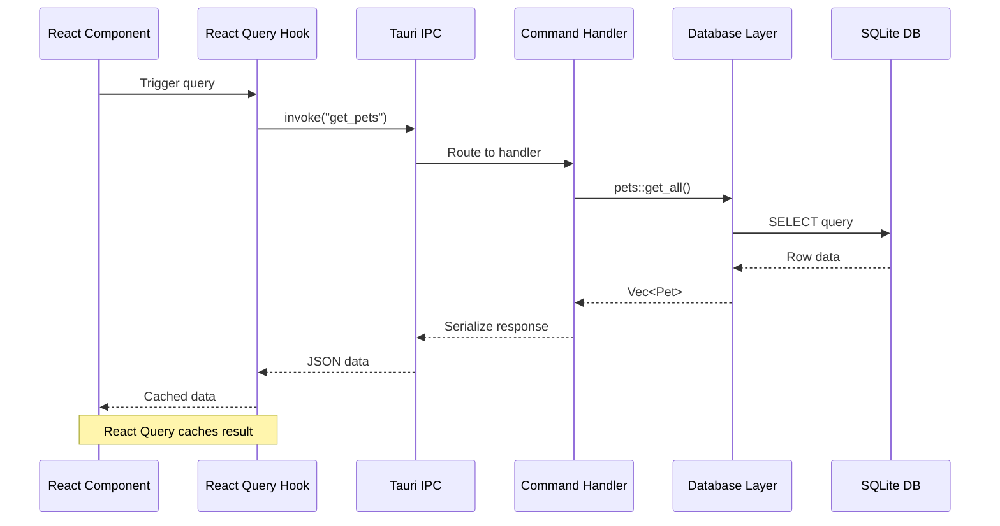

### 4.5 Migration Strategy

**Migration Files** (`src-tauri/migrations/`):

1. `20250827151006_create_pets_table.sql`:
   - Pets table with indexes
   - Display order and archival support

2. `20250906170000_create_activities_table.sql`:
   - Activities table with foreign keys
   - FTS5 virtual table for search
   - Triggers for FTS synchronization

**Migration Pattern:**
- Timestamp-based ordering
- Forward-only migrations
- Automatic execution on app start
- SQLx compile-time verification

### 4.6 Storage Architecture

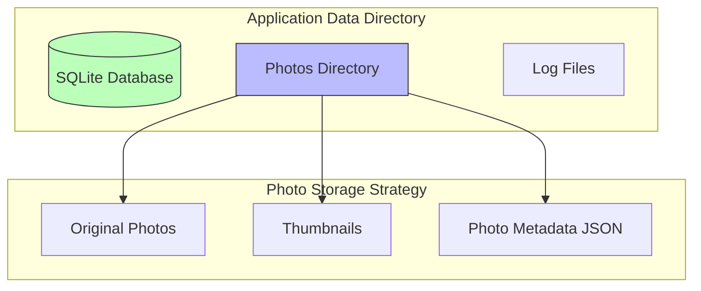

**Storage Locations:**
- **Database:** `{app_data_dir}/paw-diary.db`
- **Photos:** `{app_data_dir}/photos/`
- **Logs:** Platform-specific log directory
- **Platform-specific paths:** Handled by `dirs` crate

---

## 5. Key Design Patterns

### 5.1 Universal Header Component System

**Architecture** (see `specs/001-ios-app-header/`):

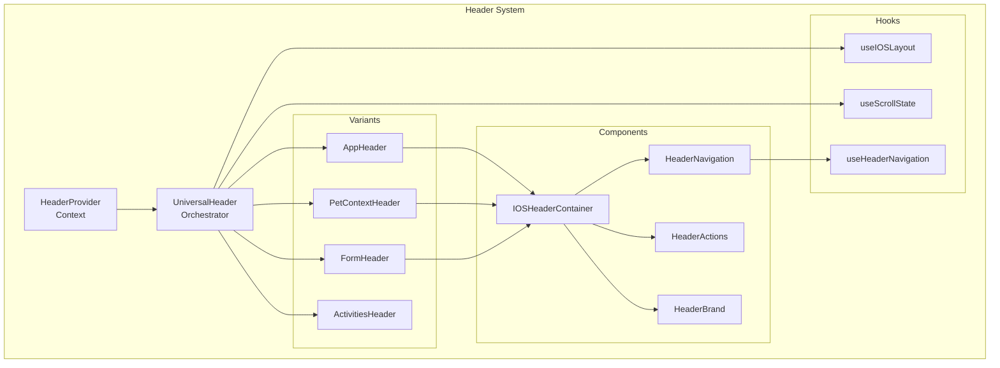

**Key Features:**
- iOS Human Interface Guidelines compliance
- Scroll-based behavior (blur, hide, auto)
- Variant system for different contexts
- Type-safe configuration with TypeScript
- Responsive design with breakpoint adaptation

**Configuration Interface** (`src/components/header/types.ts`):

```typescript
interface HeaderConfiguration {
  variant: HeaderVariant;
  title?: string;
  subtitle?: string;
  sticky?: boolean;
  scrollBehavior?: 'auto' | 'blur' | 'hide' | 'none';
  showBackButton?: boolean;
  backAction?: () => void;
  actions?: HeaderAction[];
  petContext?: PetContextConfig;
  theme?: HeaderTheme;
}
```

### 5.2 Activity Template System

**Template Architecture:**

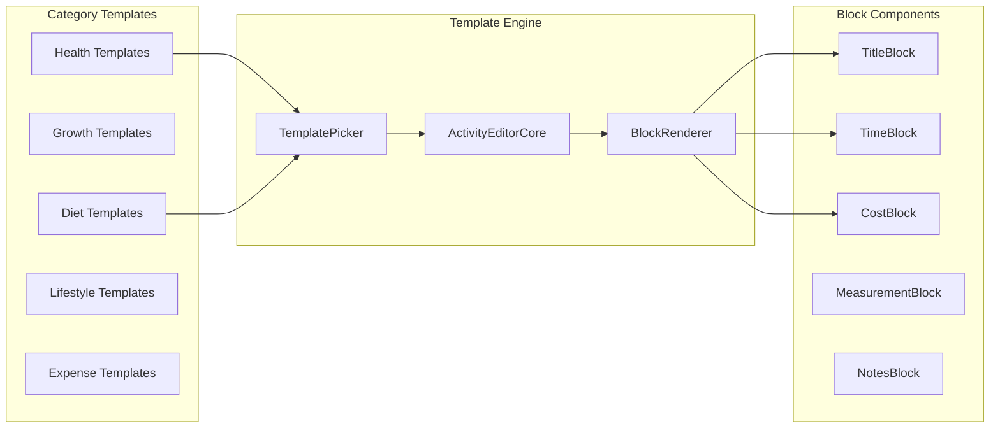

**Template Structure** (`src/lib/activityTemplates.ts`):

```typescript
interface ActivityTemplate {
  id: string;
  category: ActivityCategory;
  subcategory: string;
  icon: string;
  color: string;
  blocks: BlockConfig[];
  defaultValues?: Record<string, any>;
}
```

**Block System:**
- Composable field blocks for activity forms
- Category-specific block types
- Validation at block level
- Preview and edit modes

### 5.3 Photo Management Pattern

**Photo Upload Flow:**

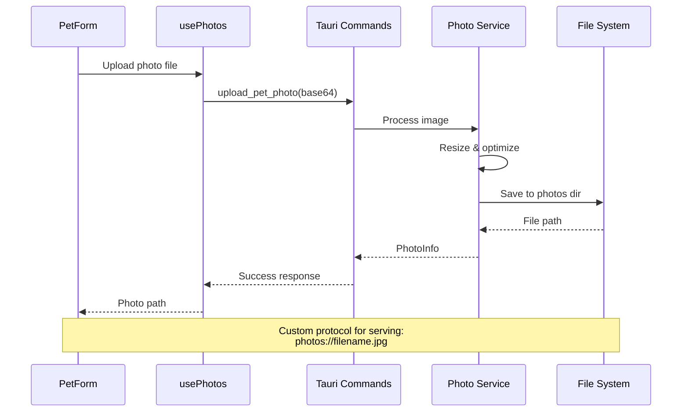

**Custom Protocol Handler** (`src-tauri/src/protocol.rs`):
- Secure photo serving via `photos://` scheme
- No direct file system path exposure
- Automatic MIME type detection
- Caching headers for performance

### 5.4 Form Validation Strategy

**Validation Layers:**

1. **Frontend Validation** (Zod schemas):
   ```typescript
   export const petFormSchema = z.object({
     name: z.string().min(1).max(100),
     birth_date: z.string().refine(/* date validation */),
     species: z.nativeEnum(PetSpecies),
     // ...
   });
   ```

2. **Backend Validation** (Rust):
   ```rust
   pub fn validate_pet(request: &CreatePetRequest) -> Result<()> {
       if request.name.trim().is_empty() {
           return Err(ValidationError::EmptyName);
       }
       // ...
   }
   ```

**Benefits:**
- Client-side UX improvements
- Server-side security guarantee
- Type-safe validation rules
- Consistent error messages

### 5.5 Error Boundary Pattern

**Error Handling Architecture:**

```typescript
// Global error boundary
<ErrorBoundary fallback={<ErrorFallback />}>
  <App />
</ErrorBoundary>

// Component-level error handling
const { data, error, isLoading } = useQuery({
  queryKey: ['pets'],
  queryFn: getPets,
  retry: 3,
  onError: (err) => toast.error(err.message)
});
```

**Error Categories:**
- Network errors (auto-retry)
- Validation errors (user feedback)
- System errors (error boundary)
- Business logic errors (custom handling)

---

## 6. Development Workflow

### 6.1 Build and Development Processes

**Development Commands:**

```bash
# Frontend development (port 1420)
yarn dev

# Tauri development (auto-launches frontend)
yarn tauri dev

# Production build
yarn tauri build

# Testing
yarn test              # Run tests
yarn test:ui           # Test UI
yarn test:coverage     # Coverage report

# Code quality
yarn lint              # ESLint
yarn format            # Prettier
```

### 6.2 Development Server Architecture

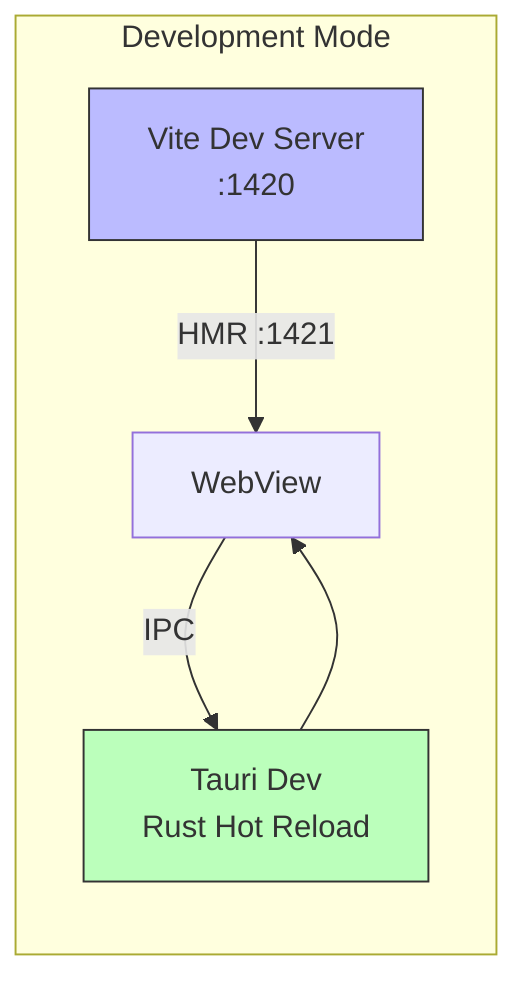

**Features:**
- Hot Module Replacement for instant UI updates
- Rust recompilation on source changes
- Automatic database migrations on startup
- Development logging to console and files

### 6.3 Testing Strategy

**Testing Stack:**
- **Unit Tests:** Vitest for React components
- **Integration Tests:** React Testing Library
- **E2E Tests:** Planned with Playwright
- **Backend Tests:** Rust `cargo test`

**Test Organization:**
```
src/
├── __tests__/          # Component tests
├── hooks/__tests__/    # Hook tests
└── lib/__tests__/      # Utility tests

src-tauri/src/
└── tests/             # Rust integration tests
```

### 6.4 Deployment Process

**Build Targets:**
- **macOS:** .dmg, .app bundle
- **Windows:** .msi, .exe
- **Linux:** .deb, .AppImage

**Build Configuration** (`src-tauri/tauri.conf.json:28-38`):

```json
{
  "bundle": {
    "active": true,
    "targets": "all",
    "icon": [
      "icons/32x32.png",
      "icons/128x128.png",
      "icons/icon.icns",
      "icons/icon.ico"
    ]
  }
}
```

---

## 7. Future Architecture Plans

### 7.1 Backend API Migration (Axum)

**Planned Architecture:**

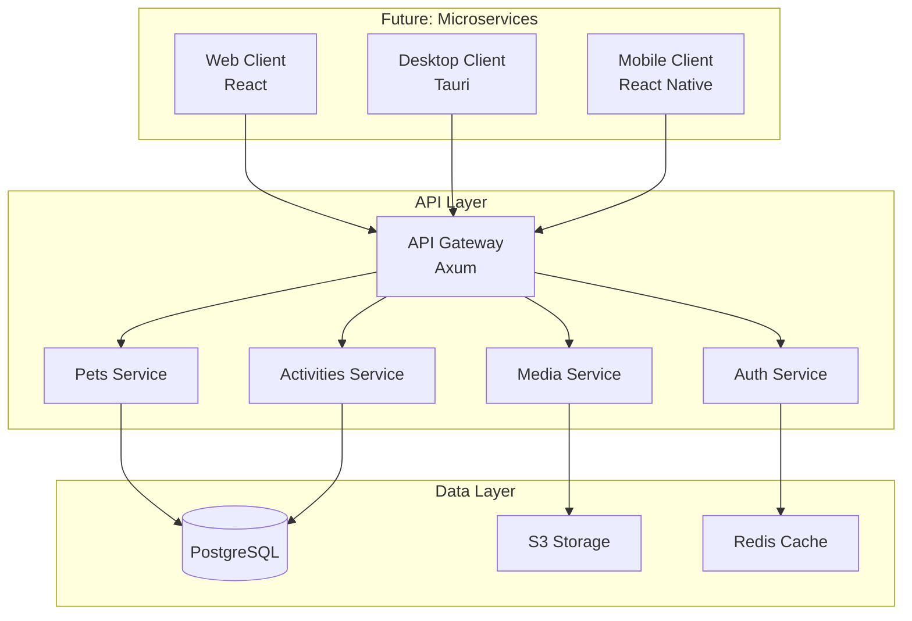

**Migration Steps:**
1. Extract business logic from Tauri commands
2. Implement Axum REST API server
3. Add authentication and authorization
4. Implement WebSocket for real-time sync
5. Deploy API separately from client apps

### 7.2 Cloud Sync Architecture

**Planned Sync Strategy:**

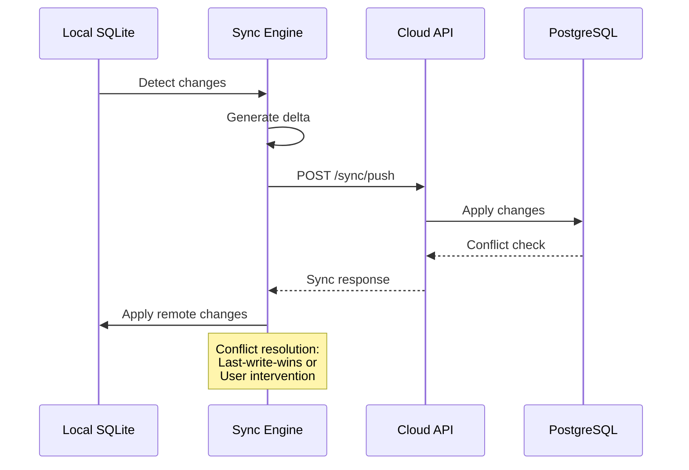

**Features:**
- Offline-first architecture
- Conflict resolution strategies
- Incremental sync with delta updates
- End-to-end encryption option

### 7.3 Scalability Considerations

**Performance Targets:**

| Metric | Current | Target (Cloud) |
|--------|---------|---------------|
| DB Query Time | <50ms | <100ms |
| Photo Upload | <2s (local) | <5s (cloud) |
| Sync Latency | N/A | <3s |
| Concurrent Users | 1 (local) | 10K+ |

**Optimization Strategies:**
1. **Database:**
   - PostgreSQL with read replicas
   - Connection pooling
   - Query optimization and indexing

2. **Media Storage:**
   - CDN for photo delivery
   - Lazy loading and progressive images
   - WebP format with fallbacks

3. **API Performance:**
   - Redis caching layer
   - GraphQL for flexible queries
   - Rate limiting and throttling

### 7.4 AI Integration Architecture

**Planned AI Features:**

```mermaid
graph TB
    subgraph "User Input"
        Text[Natural Language<br/>"今天吃了30g猫粮"]
        Photo[Pet Photo]
    end

    subgraph "AI Processing"
        NLP[NLP Service<br/>LLM]
        Vision[Computer Vision<br/>Pet Detection]
        Analysis[Health Analysis<br/>ML Model]
    end

    subgraph "Output"
        Activity[Structured Activity]
        Insights[Health Insights]
        Reminders[Smart Reminders]
    end

    Text --> NLP
    Photo --> Vision

    NLP --> Activity
    Vision --> Activity

    Activity --> Analysis
    Analysis --> Insights
    Analysis --> Reminders
```

**AI Services:**
1. **Natural Language Processing:**
   - Convert text to structured activity data
   - Multi-language support (CN, EN)
   - Context-aware parsing

2. **Computer Vision:**
   - Pet breed detection
   - Health condition assessment
   - Activity recognition

3. **Predictive Analytics:**
   - Health trend prediction
   - Expense forecasting
   - Feeding schedule optimization

**Implementation Plan:**
- LLM API integration (OpenAI/Gemini)
- Local model fine-tuning for pet domain
- Privacy-preserving on-device inference option

---

## Appendix A: File Reference Map

### Key Frontend Files

| File | Purpose | Lines |
|------|---------|-------|
| `src/App.tsx` | Main app component with routing | 134 |
| `src/main.tsx` | React entry point | ~20 |
| `src/lib/types.ts` | TypeScript type definitions | 331 |
| `src/hooks/useAppState.ts` | Global state management | ~100 |
| `src/components/header/UniversalHeader.tsx` | Header orchestrator | 202 |
| `src/pages/*` | Route page components | varies |

### Key Backend Files

| File | Purpose | Lines |
|------|---------|-------|
| `src-tauri/src/lib.rs` | Tauri app setup and commands | 71 |
| `src-tauri/src/main.rs` | Entry point | 7 |
| `src-tauri/src/database/mod.rs` | Database module | 42 |
| `src-tauri/src/database/models.rs` | Data models | 315 |
| `src-tauri/src/commands/*` | Command handlers | varies |
| `src-tauri/migrations/*` | SQL migrations | varies |

### Configuration Files

| File | Purpose |
|------|---------|
| `vite.config.ts` | Vite build configuration |
| `tsconfig.json` | TypeScript configuration |
| `tailwind.config.js` | TailwindCSS configuration |
| `src-tauri/tauri.conf.json` | Tauri app configuration |
| `src-tauri/Cargo.toml` | Rust dependencies |
| `package.json` | Node.js dependencies |

---

## Appendix B: Security Considerations

### Current Security Measures

1. **Input Validation:**
   - Frontend: Zod schema validation
   - Backend: Rust validation layer
   - Database: Type constraints and foreign keys

2. **File System Security:**
   - Sandboxed file access via Tauri
   - Custom protocol for photo serving
   - No direct path exposure to frontend

3. **Data Protection:**
   - Local SQLite with WAL mode
   - No sensitive data in localStorage
   - Planned: End-to-end encryption

### Future Security Enhancements

1. **Authentication:**
   - OAuth 2.0 / JWT tokens
   - Multi-factor authentication
   - Session management

2. **Data Encryption:**
   - At-rest encryption (SQLCipher)
   - In-transit encryption (TLS 1.3)
   - Encrypted cloud backups

3. **API Security:**
   - Rate limiting
   - CORS policies
   - API key rotation
   - Input sanitization

---

## Revision History

| Version | Date | Changes |
|---------|------|---------|
| 1.0.0 | 2025-10-02 | Initial architecture documentation |

---

**Document Maintained By:** Development Team
**Review Cycle:** Quarterly or on major architectural changes
